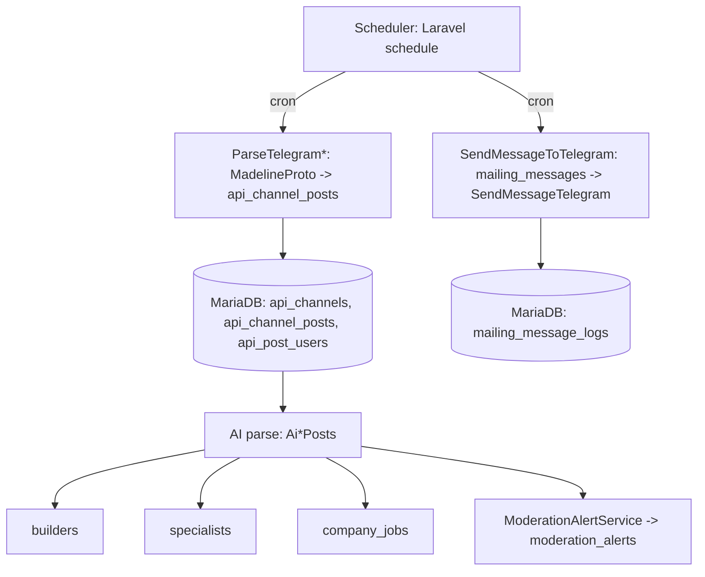
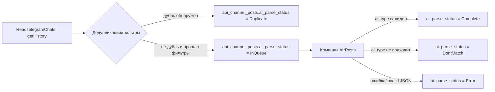
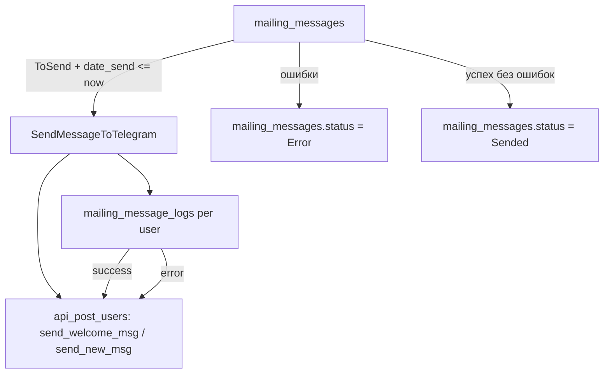

# Radarium Technical Documentation (Laravel)

> Документация разработчика по архитектуре и логике приложения Radarium.
>
> Ядро: Laravel 11 + MariaDB (по умолчанию используется в производстве) + доменная модель “посты из Telegram -> AI -> каталоги”.

## 1. Общее описание

Radarium — веб-приложение, которое:

1. Регулярно читает сообщения из источников (в текущей реализации — Telegram каналы) через `danog/madelineproto`.
2. Сохраняет “сырые” сообщения и авторов в MariaDB.
3. Обрабатывает текст через AI-провайдеры (YandexGPT и/или локальные Ollama/Qwen) и нормализует результат в доменные сущности (`builders`, `specialists`, `company_jobs`).
4. Поддерживает модерацию, тарифы доступа к контактам и рассылки в Telegram.

## 2. Архитектура верхнего уровня

### 2.1. Потоки данных (scheduler -> Telegram -> DB -> AI -> домен -> Web)



### 2.2. Роли компонентов

- **Web (HTTP)**: публичный каталог и личный кабинет, плюс API для выдачи карточек (специалисты/вакансии).
- **Admin (MoonShine)**: управление источниками (`api_channels`), AI-провайдерами (`api_ais`), словарями (`dictionary_specialities`), доменными сущностями, модерацией и рассылками.
- **Console/Background**: консольные команды + Laravel Scheduler (cron) для чтения Telegram, AI-обработки и отправки сообщений.
- **Integration services**:
  - Telegram: MadelineProto
  - AI: Yandex Foundation Models / Ollama
  - Внешний синк: Tubus (проверка/связь по телефону)
  - Платежи: Robokassa SDK

## 3. Используемые технологии

- **PHP 8.2+**
- **Laravel 11**: routing, controllers, Eloquent ORM, scheduler, validation, policies.
- **MariaDB**: доменные таблицы и логика статусов/очередей.
- **Eloquent models + Observers**: синхронизация производных полей и триггеры модерации.
- **MoonShine**: админ-панель.
- **MadelineProto (`danog/madelineproto`)**: взаимодействие с Telegram, парсинг истории и отправка сообщений.
- **HTTP client**: Laravel `Http` (YandexGPT / Ollama / Tubus).
- **Enum**: статусы “очереди” и “активности” в домене реализованы как PHP `enum`.
- **Robokassa SDK**: проверка статуса оплаты тарифов.
- **Redis (опционально)**: MadelineProto может сохранять состояние сессии/данных через Redis.

## 4. Структура приложения (слои)

Ниже приведена “карта” ключевых слоев. Для чтения модулей удобнее ориентироваться на точки входа:

- Web routes: `routes/web.php`, `routes/api.php`
- Console entrypoints: `routes/console.php` (в текущем проекте — базовый шаблон) и команды в `app/Console/Commands/*`
- Scheduler: `bootstrap/app.php`
- Telegram/AI pipeline: `app/Services/*` и `app/Console/Commands/*`
- Admin: `config/moonshine.php`, `app/Providers/MoonShineServiceProvider.php`

## 5. MariaDB: доменные таблицы и назначение

> Важно: в репозитории миграции частично задают базовую структуру, а частично — эволюцию (изменения типов/колонок). Поэтому некоторые столбцы описаны как “итоговые по текущему состоянию миграций и моделей”.

### 5.1. Источники Telegram

`api_channels`

Ключевые поля:

- `id`
- `title`, `link`, `description`
- `ai_promt` (promt/system instruction для AI)
- `api_ai_id` (ссылка на `api_ais`)
- `channel_source` (например `telegram`)
- `options` (JSON: `api_id`, `api_hash`, дополнительные параметры, напр. `reply_to_msg_id`)
- `status` (см. `ApiChannelStatusEnum`)
- `last_post_id`, `last_date_check`, `post_from_date`, `region`

Связь: `ApiChannel -> posts()` (`api_channel_posts`)

### 5.2. “Очередь” сырых сообщений из источников

`api_channel_posts`

Ключевые поля:

- `api_channel_id` (FK по логике; отдельного FK может не быть, используется `api_channel_id`)
- `user_login`, `user_login_id` (id/логин автора в Telegram контексте)
- `post_id` (id сообщения в Telegram)
- `post_date` (дата сообщения)
- `post` (текст)
- `ai_parse_status` (очередь: `InQueue`, `Complete`, `Error`, `DontMatch`, `Duplicate`, и т.п.)
- `ai_result` (результат AI; в базовой миграции — `json`, далее изменено на `text`)
- `ai_date` (когда сделан AI-парсинг)
- `ai_provider_used` (какой AI провайдер применялся)
- `api_post_user_id` (связь на `api_post_users`)

Связи:

- `ApiChannelPost->channel()` (`ApiChannel`)
- `ApiChannelPost->apiPostUser()` (`ApiPostUser`)
- `ApiChannelPost->specialist()`/`companyJob()` (через HasOne по `api_channel_post_id`)

### 5.3. Авторы сообщений (Telegram пользователи / исполнители)

`api_post_users`

Ключевые поля:

- `user_id` (telegram user id как строка в миграции)
- `username`, `first_name`, `last_name`, `user_type`, `phone`
- `channel_source` (какой источник)
- `is_company` (добавлено позднее; используется для разделения типов доменных сущностей)
- `last_online_date`
- `external_info` (JSON)
- `photo` (путь к фото; скачивается MadelineProto)
- `send_welcome_msg`, `send_new_msg` (флаги для рассылок)
- `last_post_date` (последняя дата поста, используемая для ограничения/сортировки)

### 5.4. Доменные сущности, которые формируются AI

`builders`

- `api_post_user_id`, `api_channel_post_id`
- поля “карточки строителя” (опыт, образование, about, spec_requirements, цены и т.д.)
- `status` (см. `ApiPostAiStatusEnum`)
- `ai_type`, `ai_reason` (что AI распознало и почему)
- `post_date`, `region`

`builder_specialities`

- `builder_id`
- `dictionary_speciality_id`

`builder_reviews`

Отзывы администраторов/пользователей, поля: `api_post_user_id`, `user_id`, `builder_id`, `text`, `rating`, `can_edit`, `status`.

`specialists`

- аналогично `builders`, но без ценовых/вакансийных атрибутов (поля опыта/образования/о себе и т.п.)
- `status` (см. `ApiPostAiStatusEnum`)

`company_jobs`

- поля вакансии/работодателя (position, company_name, duty/requirement/description, work_schedule, type_of_work, period и т.п.)
- `status` (см. `CompanyJobStatusEnum`)

### 5.5. Модерация

`moderation_alerts`

- `table_name`, `table_row_id` (на какой объект нужна модерация)
- `user_id` (nullable; если событие не для конкретного пользователя)
- `is_system` (system/несистемное)
- `status`, `description`, `comment`

### 5.6. Рассылки и лог доставки

`mailing_messages`

- `text` (сообщение)
- `is_main` (основное / ручное)
- `date_send`
- `status` (см. `MailingMessageStatusEnum`)

`mailing_message_logs`

- `mailing_message_id`
- `api_post_user_id`
- `msg_id` (id отправленного сообщения в Telegram)
- `status` (`MailingMessageLogStatusEnum`: success/error/unknown)

### 5.7. Тарифы/платежи и доступ к контактам

`payment_tariffs`

Ключевые поля (итоговые, судя по миграциям и модели `PaymentTariff`):

- `api_data_type` (какая отрасль/тип данных: Specialist/Builder/Company)
- `title`, `description`, `img_banner`
- `price`
- `count_contacts`
- `status`
- `period` (строка/тип в днях/формате — уточняется из миграций)
- `is_hot`

`payments`

- `user_id`, `payment_tariff_id`
- `payment_service`, `payment_hash`
- `sum`, `status`, `service_pay_id`, `description`

`user_tariffs`

- `user_id`
- `payment_tariff_id`
- `api_data_type`
- `count_month`, `count_contacts`, `count_contacts_left`
- `payment_id`, `status`
- `date_start`, `date_end`

`user_open_contacts`

- `user_tariff_id`
- `user_id`
- `api_post_user_id`

## 6. Модуль Telegram (MadelineProto)

> Основная логика парсинга Telegram реализована в `app/Services/ReadTelegramChats.php`, а команды-триггеры — в `app/Console/Commands/*ParseTelegram*`.

### 6.1. Настройки MadelineProto и сессии

В проекте MadelineProto используется напрямую через `danog/madelineproto`:

- Парсинг истории Telegram:
  - основной вход: `app/Services/ReadTelegramChats::read()`
  - сессия: `session.madeline`
  - объект: `new \danog\MadelineProto\API('session.madeline', $settings)`
- Отправка сообщений контактам:
  - основной вход: `app/Services/SendMessageTelegram::send()`
  - сессия: `session.madeline.{apiId}` (важно при параллельных запусках)

Ключевые элементы `Settings`:

- `Settings\AppInfo` задаёт `api_id`, `api_hash`, `langCode('RU')`
- `Settings\Logger` настраивает логирование MadelineProto
- `Settings\Database\Redis` задаётся опционально (если в `config('database.redis.default.password')` задан пароль)
- `Settings\Connection` и `Settings\Serialization` задают таймаут и интервал сериализации

Также в парсере есть логическая защита от раздувания логов:

- файл `storage/logs/MadelineProto.log` очищается, если размер превышает 10MB.

### 6.2. Консольные команды парсинга

Для разных доменных типов используется одинаковый сервис чтения, но разные фильтры по `api_channels`:

- `app:tg_parse:specialist` → `app/Console/Commands/ParseTelegramSpecialistChats.php`
- `app:tg_parse:builder` → `app/Console/Commands/ParseTelegramBuilderChats.php`
- `app:tg_parse:company` → `app/Console/Commands/ParseTelegramCompanyChats.php`

Каждая команда:

1. Выбирает активные Telegram-источники:
   - `channel_source = telegram`
   - `status = Active`
   - `is_company = Specialist|Builder|Company`
2. Для каждого канала вызывает `ReadTelegramChats->read($channel)`
3. Печатает `info/warn/error` агрегированные сервисом.

### 6.3. Парсинг истории и запись в MariaDB

Основной пайплайн чтения реализован в:

- `app/Services/ReadTelegramChats.php`

#### 6.3.1. Выбор лимита и ограничений

Сервис читает настройки из `configurations` через репозиторий:

- `cron_count_posts` — лимит сообщений за один запуск (`limit` для `messages->getHistory`)
- `min_length_post` — минимальная длина сообщения; короткие удаляются из результата

#### 6.3.2. Параметры получения истории

Для получения истории используется MadelineProto:

- `messages->getHistory([
  'peer' => $apiChannel->link,
  'limit' => $cron_count_posts?->value ?? 100,
  'offset_date' => strtotime($offsetDate)
])`

Где `offsetDate` выбирается так:

- если `api_channel_posts.last_date_check` отсутствует → берётся `api_channels.post_from_date`, иначе фиксированная дата-прослойка `'2025-01-01 00:00:00'`
- если `last_date_check` есть → используется она

#### 6.3.3. Предфильтрация сообщений

Сервис содержит 2 стадии фильтрации на уровне массива сообщений:

1. `checkReplyTo(&$messages)`:
   - опция задаётся в `api_channels.options['reply_to_msg_id']`
   - поддерживается список `reply_to_msg_id`, разделённый запятыми
   - специальный случай: при `reply_to_msg_id = 1` выбираются сообщения, у которых нет `reply_to`
2. `checkMinLength(&$messages)`:
   - игнорирует “технические” сервисные сообщения (если нет `message['message']` или `message['from_id']`)
   - удаляет сообщения короче `min_length_post`

#### 6.3.4. Дедупликация и состояние очереди

Перед созданием записи проверяются 2 вида “повторов”:

1. Глобальная отсечка на уровне канала:
   - если `api_channels.last_post_id >= message['id']` → сообщение пропускается
2. Дедупликация по тексту и id:
   - ищется запись в `api_channel_posts`, где `post_id != message['id']`, `post = trim(message['message'])`, `api_channel_id = текущий канал`
   - если запись найдена → текущему сообщению ставится `ai_parse_status = Duplicate`, иначе — `InQueue`

Запись реализована через:

- `ApiChannelPost::updateOrCreate([...], [...])`

При этом:

- `api_post_users` создаётся/обновляется отдельно (по `user_id` + `channel_source`)
- если у пользователя есть фото, оно загружается и сохраняется как путь в `api_post_users.photo`

#### 6.3.5. Учет автора сообщения

Для каждого сообщения:

- `MadelineProto->getInfo($message['from_id'])` получает данные пользователя
- извлекаются `first_name`, `last_name`, `username`, `phone` и `was_online`
- фото (если есть) скачивается через:
  - `$MadelineProto->photos->getUserPhotos(...)`
  - затем `downloadUserPhoto()` через `Storage::disk('public')->path('telegram/profile_photos')`

#### 6.3.6. Обновление “точки чтения” канала

После обработки:

- если сообщения получены → обновляются:
  - `api_channels.last_post_id` на `last($messagesOrigin)['id']`
  - `api_channels.last_date_check` на дату последнего полученного сообщения
- если сообщений нет:
  - при отсутствии `last_date_check` или `last_post_id` → `last_date_check` устанавливается как `offsetDate + 3 days`

#### 6.3.7. Логирование результата

Сервис пишет агрегаты в канал логов Laravel:

- `post_parser`: `Всего постов`, `Отфильтровано`, `Новых`, а также `Последний ID/Последняя дата`.

### 6.4. Загрузка фото профилей

Команда:

- `app:tg_profile:photo` → `app/Console/Commands/TelegramProfilesPhoto.php`

Логика:

1. Ищет `ApiPostUser`, у которых `photo IS NULL`
2. Создаёт MadelineProto session (обычная `session.madeline`)
3. Для каждого профиля получает `getInfo()` и если есть `User.photo` → скачивает 1 фото через `getUserPhotos(limit=1)`
4. Обновляет поле `api_post_users.photo`

### 6.5. Telegram рассылки контактам

Рассылка реализована как связка:

- Scheduler/command: `app:tg_chat:send_company` → `app/Console/Commands/SendMessageToTelegram.php`
- Service: `app/Services/SendMessageTelegram.php`

#### 6.5.1. Выбор сообщения и аудитории

`SendMessageToTelegram` использует `Configurations`:

- `mailing_tg_api_id`
- `mailing_tg_api_hash`
- `mailing_tg_new_company` (разрешение авто-рассылки приветствия компаниям)

Два режима отправки:

1. **Ручная отправка** (`is_main = 0`):
   - сообщение берётся если `status = ToSend` и `date_send <= now()`
   - аудитория: `ApiPostUser where is_company = 1` и `send_new_msg = 1`
2. **Авто-отправка приветствия** (`is_main = 1`):
   - аудитория: `ApiPostUser where is_company = 1` и `send_welcome_msg = ToSend`

После отправки `mailing_messages.status` переводится:

- в `Error`, если в процессе были ошибки
- иначе в `Sended`

#### 6.5.2. Отправка сообщений и логирование доставки

В `SendMessageTelegram->send()`:

1. Инициализируется MadelineProto session (`session.madeline.{apiId}`)
2. Для каждого пользователя:
   - если сообщение “основное” (`is_main`):
     - выставляется `send_welcome_msg = Error` (как предварительное состояние)
   - иначе:
     - выставляется `send_new_msg = 0`
3. Выполняется вызов MadelineProto `messages->sendMessage()`:
   - `peer`: `@username` если есть, иначе `user_id`
   - `message`: `mailing_messages.text`
   - `no_webpage = true`
4. Создаётся запись в `mailing_message_logs`:
   - `status = Success` или `Error`
   - `msg_id` сохраняется из ответа Telegram
5. У пользователя обновляется флаг рассылки:
   - для `is_main` → `send_welcome_msg = Sended` при успехе
6. В конце пишет агрегат в `mailing_tg` log-channel.

### 6.6. Команды Telegram для “регистрации”/входа

Команда:

- `app:tg_auth` → `app/Console/Commands/AuthTelegram.php`

Используется как вспомогательная:

- запускает `session.madeline`
- получает `getSelf()`
- при отсутствии `me['bot']` отправляет `/start` в `@stickeroptimizerbot` и присоединяется к каналу через `joinChannel`.


## 7. AI-пайплайн и провайдеры

> В текущей архитектуре AI выполняется “батчами” по очереди `api_channel_posts.ai_parse_status = InQueue`.
>
> Три консольные команды обрабатывают разные типы источников (специалисты, строители, вакансии) и создают соответствующие доменные сущности.

### 7.1. Очередь AI: `api_channel_posts.ai_parse_status`

Статусы очереди задаются `app/Enum/ApiChannelPostStatusEnum.php`:

- `InQueue` — пост готов к AI-обработке
- `Complete` — AI успешно распознал и создал доменную сущность
- `Error` — ошибка AI (парсинг/запрос/декод JSON)
- `DontMatch` — AI распознал “не тот тип сообщения”
- `Duplicate` — сообщение было “дубликатом” на этапе Telegram-парсинга

### 7.2. Точки входа: консольные команды AI

- `app:ai_parse:specialist` → `app/Console/Commands/AiSpecialistPosts.php`
- `app:ai_parse:builder` → `app/Console/Commands/AiBuilderPosts.php`
- `app:ai_parse:company` → `app/Console/Commands/AiCompanyPosts.php`

Каждая команда:

1. Выбирает порцию постов из `api_channel_posts`, где `ai_parse_status = InQueue`.
2. Делает JOIN на `api_channels`, чтобы отфильтровать тип (`api_channels.is_company` == `Specialist|Builder|Company`).
3. Берёт limit (в коде используется `take(100)` + отдельный подсчёт объёма).
4. Для каждого поста:
   - получает prompt: `post->channel->ai_promt`
   - получает options AI-провайдера: `post->channel->apiAi->options`
   - выбирает провайдер по `api_source`
   - вызывает `getResult(...)`
   - валидирует распознанный `ai_type`
   - создаёт доменную запись (и связи со специализациями)
   - обновляет `api_channel_posts.ai_parse_status`
   - при необходимости создаёт запись модерации

### 7.3. Выбор провайдера и схему ответа

AI провайдеры описаны в таблице `api_ais` (модель: `app/Models/ApiAi.php`), а источник выбирается по `api_ais.api_source`:

- `yandexgtp4` → `app/Services/ApiAIYandex.php`
- `ollama_qwen` → `app/Services/ApiAIOllama.php`

Если в `api_source` приходит неизвестное значение — пост пропускается с `warn`.

#### 7.3.1. `ApiAIYandex`

`app/Services/ApiAIYandex.php`:

- использует HTTP endpoint Yandex Foundation Models:
  - `https://llm.api.cloud.yandex.net/foundationModels/v1/completion`
- передаёт `Api-Key` (из `options['API_KEY_TOKEN']`)
- формирует payload с `modelUri = gpt://{folderId}/yandexgpt/rc`
- ожидает ответ вида:
  - `alternatives[0].message.text`, внутри которого лежит JSON (возможно в блоках ```...```)

После `json_decode` сервис приводит поля к форматам доменной модели:

- `price`: умножение на 100 (перевод в копейки)
- `integer`: `(int)`
- `array_string`: сериализация массива в строки вида `key: value` через `implode`

Возвращаемый результат:

- `origin` — “как было в ответе” (для трассировки в `api_channel_posts.ai_result`)
- `json` — нормализованные поля под создание `builders/specialists/company_jobs`

#### 7.3.2. `ApiAIOllama`

`app/Services/ApiAIOllama.php`:

- endpoint: `POST {host}/v1/chat/completions`
- модель: `config('services.ollama.model')` или `options['model']`
- ожидает в ответе:
  - `choices[0].message.content`

Парсинг JSON такой же по смыслу:

- удаляет обрамляющие ```json / ```.
- делает `json_decode` и приводит типы (price->копейки, bool, integer и т.д.).

### 7.4. Нормализация и создание доменных сущностей

#### 7.4.1. Builders (`AiBuilderPosts`)

Флоу:

1. Получает `result['json']` от провайдера.
2. Нижним регистром приводит `ai_type`.
3. Допускает только:
   - `резюме`
   - `предоставление услуги`
   - `предложение услуг`
4. Если тип не допустим:
   - ставит `api_channel_posts.ai_parse_status = DontMatch`
   - сохраняет и пропускает создание `Builder`
5. Если тип допустим:
   - дополняет JSON полями:
     - `post_date`, `api_post_user_id`, `api_channel_post_id`
     - `status = ApiPostAiStatusEnum::Active`
     - `contact_info` (пустое поле нормализуется в строку '')
     - `region` (если задан)
   - удаляет предыдущие записи builders для данного `api_channel_post_id`:
     - `Builder::where('api_channel_post_id', $post->id)->delete();`
   - создаёт builder: `Builder::create($result['json'])`
   - назначает специализации:
     - `Dictionary->checkMatchByList($post->post, $specialityList)`
     - `Dictionary->updateRelations(DictionaryEnum::Speciality, 'builder', $builder->id, ...)`
   - переводит пост в `Complete`

#### 7.4.2. Specialists (`AiSpecialistPosts`)

Логика аналогична builders:

- допустимые `ai_type`:
  - `резюме`
  - `предоставление услуги`
  - `предложение услуг`
- создаётся `Specialist`
- назначаются специализации через dictionary

#### 7.4.3. Company Jobs (`AiCompanyPosts`)

Флоу похож, но доменный статус и допустимые типы отличаются:

- `ai_type` допускает:
  - `вакансия`
  - `поиск того кто окажет услугу`
  - `поиск подрядчика`
- создаётся `CompanyJob`
- `status = CompanyJobStatusEnum::Active`
- пост переводится в `Complete`

### 7.5. Модерация как побочный эффект AI

После создания доменной записи AI-команда вызывает:

- `app/Services/ModerationAlertService::createAlert(...)`

и создаёт `moderation_alerts` если статус доменной записи:

- `InModeration` или `Active`

Состав `createAlert`:

- `userId` = 0 (system-событие)
- `isSystem` = `ModerationAlertSystemEnum::System`
- `tableName` = `ModerationAlertTableNameEnum::{Builder|Specialist|CompanyJob}`
- `tableRowId` = id созданной записи

### 7.6. Обработка ошибок

В каждой AI-команде предусмотрены два основных уровня `catch`:

- `TypeError`: AI/парсер JSON не соответствует ожидаемым типам
- общий `\Exception`: ошибки HTTP, ошибок в структуре ответа, или любых неожиданных исключений

Для обеих веток:

- `api_channel_posts.ai_result` сохраняется как текст ошибки
- `api_channel_posts.ai_date = now()`
- `api_channel_posts.ai_parse_status = Error`

### 7.7. Примечание про `ApiAIE5`

В проекте подключён `danog/madelineproto` и есть файл `app/Services/ApiAIE5.php`, однако он в текущем виде пустой/не содержит рабочей реализации.
Поэтому E5 не описывается как реально используемый провайдер.

## 8. Словарь и маппинг специализаций

Сопоставление текста поста с “нужными” специализациями выполняется через `app/Services/Dictionary.php` и результат записывается в таблицы связей:

- `builder_specialities` (`BuilderSpeciality`)
- `specialist_specialities` (`SpecialistSpeciality`)
- `company_job_specialities` (`CompanyJobSpeciality`)

Ключевые элементы реализации:

### 8.1. `Dictionary` — подбор по ключевым словам

Файл: `app/Services/Dictionary.php`

Основные методы:

1. `getAll(DictionaryEnum $dictionary, ApiDataTypeEnum $apiDataType)`
   - для текущей реализации поддерживается в основном `DictionaryEnum::Speciality`
   - возвращает `DictionarySpeciality` с `api_data_type_id = $apiDataType`

2. `checkMatchByList($text, $list): array`
   - для каждого элемента словаря берёт `key_words` (массив)
   - формирует regex по шаблону:
     - границы слова `\b`
     - набор альтернатив через `|`
     - optional suffix: `(?:-[а-яa-z]*)?`
   - выполняет `preg_match_all` с модификатором `iu`
   - если совпадения найдены — добавляет `item->id` в список

3. `updateRelations(DictionaryEnum $dictionary, string $model, int $rowId, array $dictionaryIds)`
   - выбирает join-модель и имя ключа по `$model`:
     - `specialist` → `SpecialistSpeciality` и `specialist_id`
     - `companyJob` → `CompanyJobSpeciality` и `company_job_id`
     - `builder` → `BuilderSpeciality` и `builder_id`
   - если `dictionaryIds` пустой:
     - удаляет все связи для объекта (`where(...rowIdName...)->delete()`)
   - иначе:
     - удаляет только связи “не из списка”
     - создаёт/гарантирует существование нужных связей через `firstOrCreate`

### 8.2. `DictionarySpeciality` — структура словаря

Модель: `app/Models/DictionarySpeciality.php`

Итоговые поля (по миграциям изменения таблицы):

- `group_title` — “группа специализаций”
- `title` — название “элемента” специализации
- `short_name` — короткое имя (генерируется/обновляется в миграциях)
- `key_words` — JSON-массив ключевых слов/вариантов
- `api_data_type_id` — для каких доменных типов актуально (Specialist/Builder/Company)

Пополнение словаря выполняется через миграции-скрипты (например `2025_04_05_000238_builder_dictionary_specialities_table.php`, а также `change_dictionary_specialities_table.php` и др.). Эти миграции “грузят” JSON-структуры и делают `truncate()/create()` для обновления справочника.

### 8.3. Команда `SpecialityPosts` — заполнение пропусков

Файл: `app/Console/Commands/SpecialityPosts.php`

Задача команды: назначить специализации тем доменным сущностям, у которых ещё нет связей со специализациями.

Процесс:

1. Для `Specialist`:
   - берутся `specialists`, которые отсутствуют в `specialist_specialities` (через `whereNotIn` + subquery)
   - дополнительно проверяется, что у специалиста есть `post` (`has('post')`)
   - для каждого специалиста выполняется `checkMatchByList($specialist->post->post, $specialityList)`
   - результат записывается в join-таблицы через `updateRelations(..., 'specialist', ...)`

2. Для `Builder`:
   - аналогично, но для `builder_specialities` и `updateRelations(..., 'builder', ...)`

### 8.4. Использование маппинга в web/UI и API

Сайтовые фильтры и отображение “умных” тегов опираются на отношения:

- `ApiPostUser->specialists()` / `->builders()`
- `SpecialistSpeciality->dictionarySpeciality`
- `BuilderSpeciality->dictionarySpeciality`

Например, в модели `ApiPostUser` есть методы:

- `specialtiesWithShortName($substr = 0)`
- `builderSpecialtiesWithShortName($substr = 0)`

Они собирают отображаемое имя (с учётом `short_name` и `title`) и возвращают структуру, удобную для фронтенда.

## 9. Модерация и уведомления

Модерация инициируется двумя путями:

1. **System-вызов** — когда AI создал доменную сущность со статусом, требующим модерации (`Active`/`InModeration`).
2. **User-вызов** — когда пользователь/админ отправляет обращение по конкретному объекту через HTTP (`ModerationAlertController`).

### 9.1. `ModerationAlertService` — создание записи

Файл: `app/Services/ModerationAlertService.php`

Метод `createAlert(...)` создаёт `moderation_alerts`:

- `user_id` — в системном сценарии может быть `0`
- `is_system` — `ModerationAlertSystemEnum::System` или `User`
- `table_name` — enum `ModerationAlertTableNameEnum` (какая сущность)
- `table_row_id` — id объекта
- `status` — `ModerationAlertStatusEnum::New`
- `description` — опционально текст

### 9.2. Триггер на создание: `ModerationAlertObserver`

Файл: `app/Observers/ModerationAlertObserver.php`

На событие `created(MediationAlert $moderationAlert)`:

1. Строится URL карточки админки:
   - `new ModerationAlertResource()->detailPageUrl($moderationAlert->id)`
2. Отправляется нотификация в MoonShine:
   - `MoonShineNotification::send(...)`
   - сообщение: `Новая модерация`
   - кнопка `Открыть` ведёт на resource page

### 9.3. Где создаются moderation alerts в pipeline

AI-команды создают доменные сущности и затем (при нужном статусе) вызывают `ModerationAlertService->createAlert(...)`:

- `AiBuilderPosts` → `ModerationAlertTableNameEnum::Builder`
- `AiSpecialistPosts` → `ModerationAlertTableNameEnum::Specialist`
- `AiCompanyPosts` → `ModerationAlertTableNameEnum::CompanyJob`

В обоих случаях:

- system-событие (`userId = 0`)
- создаётся alert с `table_row_id = {id доменной сущности}`

### 9.4. User-вызов модерации через HTTP

Контроллер: `app/Http/Controllers/ModerationAlertController.php`

Метод `store(ModerationAlertPostRequest $request)`:

1. Достаёт `type` и `row_id` из запроса.
2. Проверяет, что текущий пользователь ещё не создавал alert по этой записи:
   - `ModerationAlert::where('user_id', ...)->where('table_name', ...)->where('table_row_id', ...)->first()`
3. Создаёт `ModerationAlert` с:
   - `is_system = ModerationAlertSystemEnum::User`
   - `status = ModerationAlertStatusEnum::New`

### 9.5. Связь между alert и доменным объектом

Модель: `app/Models/ModerationAlert.php`

Метод `getObject()`:

- использует `table_row_id` и `table_name`
- динамически собирает класс: `\\App\\Models\\{table_name->value}`
- делает `where('id', table_row_id)->first()`

Это позволяет отображать контент “что именно под модерацией” в админке.

## 10. Scheduler и фоновые задачи

Расписание задач реализовано в `bootstrap/app.php` с использованием Laravel Scheduler.

### 10.1. Расписание чтения Telegram-каналов

Частота определяется конфигурацией `configurations.read_source_cron`, которая хранится в БД и задаётся через `ConfigurationsSeeder`.

Логика:

1. Если `read_source_cron.value` задан и <= 59:
   - интервал в минутах: `*/{value} * * * *`
2. Если `read_source_cron.value` задан и <= 1439 (до ~24 часов):
   - интервал в часах: `0 */ceil(value/60) * * *`
3. Если значение больше:
   - каждый день `0 0 * * *`

Если конфигурация не задана — используется fallback: `hourly()`.

В любом из режимов выполняются команды:

- `app:tg_parse:specialist`
- `app:tg_parse:builder`
- `app:tg_parse:company`

Каждая команда запускается с `withoutOverlapping()` (защита от повторного запуска “той же команды”).

### 10.2. Расписание AI-обработки

Каждые 30 минут:

- `app:ai_parse:specialist`
- `app:ai_parse:builder`
- `app:ai_parse:company`

Запускаются в группе и также защищены `withoutOverlapping()`.

### 10.3. Расписание внешних интеграций и сервисов

1. **Tubus синхронизация**:
   - `app:tubus`
   - `hourly()`
2. **Истечение/актуальность тарифов**:
   - `app:tariff:users`
   - `everyFifteenMinutes()`
3. **Проверка платежей (Robokassa)**:
   - `app:payments:check`
   - `everyTwoMinutes()`
4. **Telegram рассылки приветствий/текстов компаниям**:
   - `app:tg_chat:send_company`
   - `everyMinute()`

Дополнительно в расписании есть:

- `auth:clear-resets` (очистка токенов сброса пароля), каждые 15 минут.

> Примечание по сессии MadelineProto:
>
> Telegram-часть использует файлы `session.madeline` / `session.madeline.{apiId}`. Запуски парсеров защищены `withoutOverlapping()`, но команды разных типов (specialist/builder/company) стартуют в одно и то же окно времени. Для масштабирования и увеличения частоты стоит дополнительно контролировать конкуренцию по session file.

### 10.4. Короткая справка по ключевым командам

- `ParseTelegramSpecialistChats`, `ParseTelegramBuilderChats`, `ParseTelegramCompanyChats`:
  - читают `api_channels` и создают/обновляют `api_channel_posts` + `api_post_users`
  - статус `ai_parse_status` ставится на этапе Telegram
- `AiSpecialistPosts`, `AiBuilderPosts`, `AiCompanyPosts`:
  - выбирают `api_channel_posts.ai_parse_status = InQueue`
  - создают `specialists` / `builders` / `company_jobs`
  - переводят пост в `Complete`/`Error`/`DontMatch`
- `SyncUsersWithTubus`:
  - обновляет `users.tubus_id` по `users.phone`
- `CheckUserTariffs`:
  - помечает `user_tariffs.status = Ended` когда `date_end <= now()`
- `PaymentStatusCheck`:
  - запрашивает состояние у Robokassa и обновляет `payments.status`
- `SendMessageToTelegram`:
  - отправляет `mailing_messages` контактам `api_post_users` и записывает `mailing_message_logs`

## 11. Web/UI и API

### 11.1. Web маршруты

Основные точки входа:

- `routes/web.php`
- `routes/auth.php` (регистрация/логин/верификация email)

Публичные страницы:

- `GET /` → `IndexController@index`
- `GET /tech` → `IndexController@tech`

Страницы каталога/карточек, доступные авторизованным и проверенным пользователям (`auth`, `verified`):

- `GET /specialists` и `GET/POST /specialists/specialist/{id}`
- `GET /companyjobs` и `GET /companyjobs/companyjob/{id}`
- `GET /builders` и `GET/POST /builders/builder/{id}`

### 11.2. Каталоги и управление отзывами

Каталог строится вокруг доменных сущностей `specialists`, `builders`, `company_jobs` и их связи с авторами `api_post_users`.

Ключевые контроллеры:

- `app/Http/Controllers/CatalogController.php`
  - выдаёт список специалистов и карточку автора специалиста
  - фильтрует по `ApiPostAiStatusEnum::Active` (если `onlyActive`)
  - использует словарь специализаций (`DictionarySpecialityRepository`) для UI-фильтра
- `app/Http/Controllers/BuilderController.php`
  - аналогично для строителей (поиск/страницы/отзывы)

Отзывы:

- создаются через HTTP POST методы контроллеров каталога
- валидация выполнена через `$request->validate()` и `Rule::exists(...)`

### 11.3. Тарифы и доступ к контактам (UI)

Доступ к контактам на стороне фронтенда контролируется `app/Services/Tariff.php`.

Логика:

- `Tariff->checkContactAccess()` отвечает: можно ли показывать контакт прямо сейчас
- `Tariff->checkOpenContact()` отвечает: можно ли открыть контакт конкретного `ApiPostUser`
- при успешном открытии контакта ведётся запись в `user_open_contacts` (`Tariff->addOpenContactLog`)
- если у пользователя остались `free_contacts`, доступ уменьшается при первом открытии нового контакта

Покупка тарифа:

- контроллер: `app/Http/Controllers/TariffController.php`
- метод `buy()`:
  - отдаёт страницу покупки
  - формирует `paymentLink` через Robokassa
  - создаёт (или берёт существующий) `payments` со статусом `PaymentStatusEnum::New`
- контроллер возвращает view `tariff.buy`

Профиль/подписки:

- `SubscribeController@main()` → список активных/завершённых `user_tariffs` и список `payments`.

### 11.4. Слой API

API маршруты в `routes/api.php` с throttling:

- `GET /specialists`
- `GET /specialists/specialist/{id}`
- `GET /companyjobs`
- `GET /companyjobs/companyjob/{id}`

Реализация:

- `app/Http/Controllers/Api/ApiCatalogController.php`
  - выдаёт коллекции с пагинацией (`paginate(5)`)
  - использует `ApiPostAiStatusEnum`/`CompanyJobStatusEnum` чтобы фильтровать только активные (в зависимости от `onlyActive`)
  - отдаёт доменные модели (Eloquent) напрямую как JSON

### 11.5. HTTP интеграции в UI

- Robokassa: `TariffController` создаёт платеж
- Robokassa callback (статус) не показан в коде как webhook — вместо этого статус проверяется cron-командой `PaymentStatusCheck`.

## 12. Админ-панель (MoonShine)

Админка реализована через MoonShine.

### 12.1. Базовая конфигурация MoonShine

Файл: `config/moonshine.php`

Ключевые параметры:

- `dir: app/MoonShine` (где лежат ресурсы и страницы)
- `route.prefix: admin` (переопределяемо через `MOONSHINE_ROUTE_PREFIX`)
- `auth.enable: true` и middleware `MoonShine\Http\Middleware\Authenticate`
- `disk: public` (использование файловой системы)
- включены:
  - `use_notifications`
  - `use_theme_switcher`

### 12.2. Регистрация layout и ресурсов

- Layout: `app/MoonShine/MoonShineLayout.php`
  - строит интерфейс с sidebar и поиском
- Menu/Resources: `app/Providers/MoonShineServiceProvider.php`
  - описывает структуру меню и связывает её с `*Resource` классами:
    - `ApiAiResource`, `ApiChannelResource`, `ApiChannelPostResource`, `ApiPostUserResource`
    - `DictionarySpecialityResource`
    - `ModerationAlertResource`
    - доменные ресурсы: `SpecialistResource`, `BuilderResource`, `CompanyJobResource`
    - продвижение: `MailingMessageResource`, `CompanyAuthorsResource` и т.д.

### 12.3. События и уведомления

MoonShine уведомления используются для модерации:

- `app/Observers/ModerationAlertObserver.php` отправляет `MoonShineNotification` на создание `moderation_alerts`.

Так администраторы видят “новые модерации” почти в реальном времени без ручной проверки.

## 13. Точки расширения/изменений

Ниже перечислены основные “ручки”, через которые в Radarium меняют логику без правки кода, либо точки в коде, куда надо вмешиваться при расширении функциональности.

### 13.1. Источники сообщений Telegram (`api_channels`)

Ключ: запись в `api_channels` полностью задаёт поведение парсера и AI-обработки:

- какой канал читать: `link`, `channel_source = telegram`
- какой AI-провайдер применять: `api_ai_id`
- какой prompt отправлять LLM: `ai_promt`
- как фильтровать сообщения до записи в очередь:
  - `options['reply_to_msg_id']` → фильтрация `checkReplyTo()`
  - `options['api_id']` / `options['api_hash']` → настройка MadelineProto для чтения
- сдвиг/регион:
  - `last_post_id`, `last_date_check`, `post_from_date`
  - `region` (влияет на создание доменных сущностей и отображение/фильтры)

Точка расширения: если появятся новые источники помимо Telegram — понадобится либо расширить общий интерфейс чтения (аналог `ReadTelegramChats`), либо создать новый сервис и новые console-команды/фильтры под `channel_source`.

### 13.2. AI-провайдеры (`api_ais`)

`api_ais` управляет:

- включением/выключением AI: `status`
- выбором движка: `api_source`
- параметрами выполнения: `options` (контракт зависит от провайдера)

Контракты options:

- для `ApiAIYandex` нужны:
  - `API_KEY_TOKEN`
  - `Folder_id`
- для `ApiAIOllama`:
  - `host` и `model` могут быть в `options` (fallback берётся из `config('services.ollama.*')`)

Точка расширения: чтобы добавить новый AI-провайдер:

1. Добавить новый кейс в `ApiAiSourceEnum`
2. Реализовать новый сервис по образцу `ApiAIYandex`/`ApiAIOllama`
3. Обновить выбор провайдера в `AiBuilderPosts`/`AiSpecialistPosts`/`AiCompanyPosts`
4. Реализовать схему маппинга JSON → поля доменных моделей (аналогично `getKeyRows`)

### 13.3. Словарь специализаций (`dictionary_specialities`)

Решение “какие специализации присвоить посту” определяется справочником:

- `key_words` (JSON-массив строк)
- соответствие типу данных: `api_data_type_id`

Изменения обычно вносят через миграции-скрипты (обновляющие `DictionarySpeciality`) и/или вручную через админку.

Также предусмотрен backfill:

- `app:posts:speciality` (`SpecialityPosts`)

### 13.4. Расписание фоновых задач (`bootstrap/app.php` + `configurations`)

Тонкая настройка частоты чтения Telegram делается через:

- `configurations.read_source_cron` (БД)

Интервалы AI/рассылок/платежей/тубус-синхронизации заданы в:

- `bootstrap/app.php`

### 13.5. Конкурентный запуск MadelineProto (session-файлы)

Telegram парсинг использует фиксированную сессию `session.madeline` в `ReadTelegramChats` и `TelegramProfilesPhoto`, а отправка сообщений — `session.madeline.{apiId}`.

Если повысить частоту параллельных команд, могут возникнуть конфликты доступа к session-пути. Текущая защита — `withoutOverlapping()` на уровне каждой команды.

### 13.6. Наблюдаемость (логирование)

Ключевые каналы логирования:

- `post_parser` — `ReadTelegramChats`
- `ai_debug` — подробные лог-сообщения AI сервисов
- `mailing_tg` — рассылки
- `tubus`, `payments` — внешние интеграции

См. `config/logging.php`.

### 13.7. Модерация

Модерация создаётся автоматически системой после AI, если доменная сущность в состоянии требующем модерации.

Если нужно расширить причины/условия — править логику в `Ai*Posts` и/или добавить новые ветки в сервисы/Observers.

## 14. Приложение: статусы и “машины состояний”

Ниже приведены основные “машины состояний” для ключевых стадий пайплайна (очереди парсинга, AI-обработки, модерации, рассылок и платежей).

### 14.1. Telegram-парсинг → AI-очередь (`api_channel_posts.ai_parse_status`)



Ключевые свойства:

- AI обрабатывает только `InQueue`.
- `Duplicate` не отправляется в AI.

### 14.2. Доменные статусы (`builders.status`, `specialists.status`, `company_jobs.status`)

- `builders.status` и `specialists.status` — `ApiPostAiStatusEnum`:
  - `Active` — видимы в каталоге
  - `InModeration` — требуют модерации
  - `Disabled` — скрыты/отключены
  - `Error` — ошибка
- `company_jobs.status` — `CompanyJobStatusEnum`:
  - `Active` / `InModeration` / `Disabled` / `Error`

В текущем AI-пайплайне при успешном распознавании создаются записи со статусом “active”.
Дальнейшая смена статуса происходит в админке/модерации (MoonShine), а не в автоматах AI-команд.

### 14.3. Модерация (`moderation_alerts.status`)

`ModerationAlertStatusEnum`:

- `New` — создан
- `Done` — закрыт
- `Rejected` — отклонён

Событие создания:

- system-alert создаётся в `Ai*Posts` через `ModerationAlertService`
- пользовательский alert создаётся через `ModerationAlertController@store`
- уведомление отправляется `ModerationAlertObserver` (MoonShineNotification)

### 14.4. Telegram рассылки (`mailing_messages` и `mailing_message_logs`)



Статусы:

- `MailingMessageStatusEnum`: `ToSend`, `Sended`, `Canceled`, `Error`
- `MailingMessageLogStatusEnum`: `Success`, `Error`, `Unknown`

### 14.5. Платежи и тарифы (`payments`, `user_tariffs`, `user_open_contacts`)

`payments.status` (`PaymentStatusEnum`):

- `New` → оплата создана и ждёт проверки
- `Success` → подтверждена
- `Error` → ошибка проверки
- `TTL` → истечение ожидания
- `Canceled` → отмена

Переходы делают cron-команды:

- `PaymentStatusCheck` → обновляет `payments.status` на основе Robokassa (`Robokassa::opState`)
- `CheckUserTariffs` → переводит `user_tariffs.status = Ended` при `date_end <= now()`

Открытие контактов:

- `Tariff->checkOpenContact()` ограничивает открытие через:
  - `user_tariffs.count_contacts_left`
  - `users.free_contacts`
- факт открытия фиксируется в `user_open_contacts`


