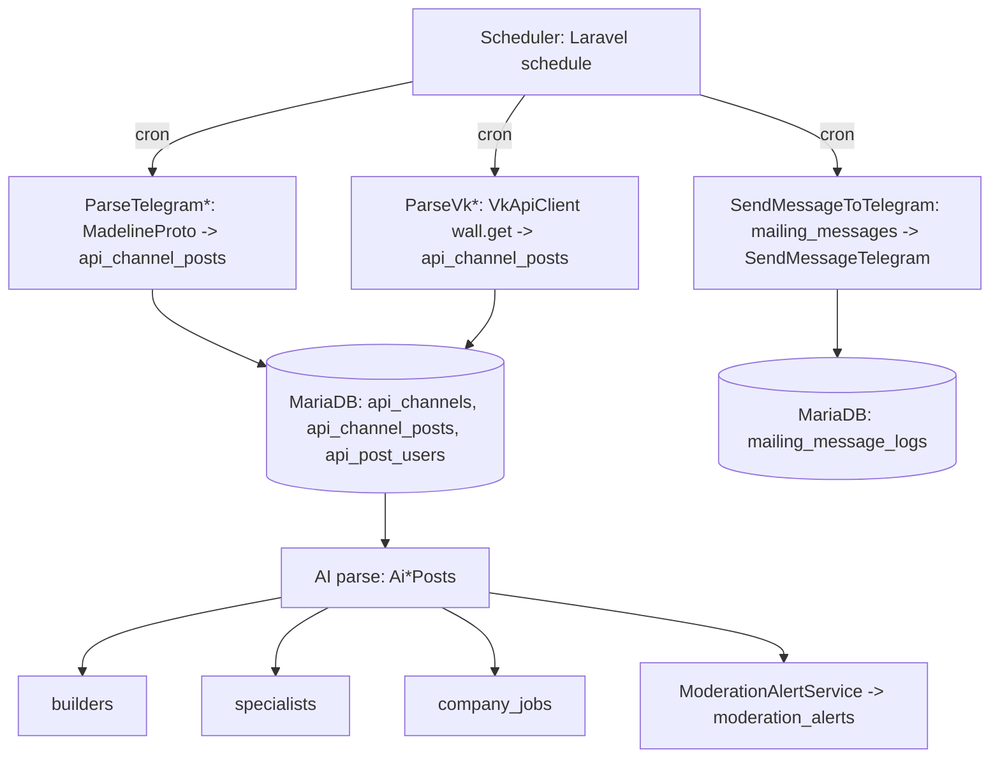
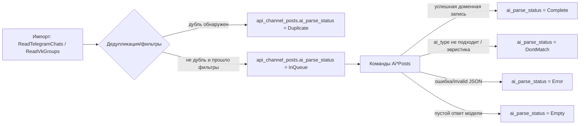
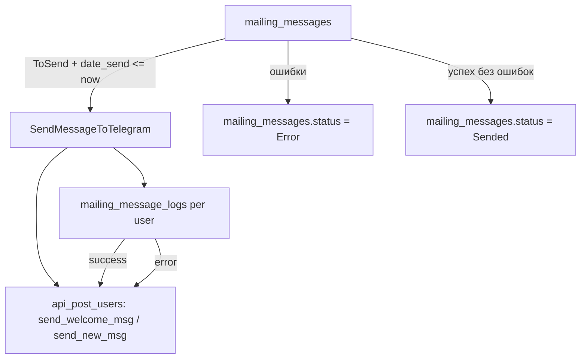

# Radarium Technical Documentation (Laravel)

> Документация разработчика по архитектуре и логике приложения Radarium.
>
> Ядро: Laravel 11 + MariaDB (по умолчанию используется в производстве) + доменная модель “посты из источников (Telegram / ВКонтакте) → AI → каталоги”.
>
> **Актуализация:** первоначальная версия файла — 2026-03-26; ниже учтены изменения репозитория по состоянию на **2026-08-06** (см. также `DOC/CHANGE_LOG.md`): VK-импорт, `CatalogPublicationGate`, двухэтапный Builder AI pipeline, эвристики найма/спама, MadelineProto shared session, модерация постов, регионы, сессии/CSRF, отчёт активных авторов, восстановление TG-сессий и `app:tg_auth --qr`, runbook `git pull` на production, инцидент VPN Reality / MadelineProto (июль–август 2026, §6.9).

## 1. Общее описание

Radarium — веб-приложение, которое:

1. Регулярно читает сообщения из источников: **Telegram** (`danog/madelineproto`) и **ВКонтакте** (HTTP API `wall.get` через `VkApiClient` / сервис `ReadVkGroups`). Тип источника задаётся в `api_channels.channel_source` (`ApiChannelSourceEnum`: `telegram` | `vk`).
2. Сохраняет “сырые” сообщения и авторов в MariaDB (единая модель `api_channel_posts` / `api_post_users` для обоих каналов).
3. Обрабатывает текст через AI-провайдеры (YandexGPT и/или локальные Ollama/Qwen) и нормализует результат в доменные сущности (`builders`, `specialists`, `company_jobs`).
4. Поддерживает модерацию, тарифы доступа к контактам и рассылки в Telegram.

## 2. Архитектура верхнего уровня

### 2.1. Потоки данных (scheduler -> Telegram -> DB -> AI -> домен -> Web)



### 2.2. Роли компонентов

- **Web (HTTP)**: публичный каталог и личный кабинет, плюс API для выдачи карточек (специалисты/вакансии).
- **Admin (MoonShine)**: управление источниками (`api_channels`), AI-провайдерами (`api_ais`), словарями (`dictionary_specialities`), доменными сущностями, модерацией и рассылками.
- **Console/Background**: консольные команды + Laravel Scheduler (cron) для чтения Telegram и VK, AI-обработки и отправки сообщений.
- **Integration services**:
  - Telegram: MadelineProto
  - ВКонтакте: VK API (`VkApiClient`, токен `VK_SERVICE_TOKEN`)
  - AI: Yandex Foundation Models / Ollama
  - Внешний синк: Tubus (проверка/связь по телефону)
  - Платежи: Robokassa SDK

## 3. Используемые технологии

- **PHP 8.2+**
- **Laravel 11**: routing, controllers, Eloquent ORM, scheduler, validation, policies; health-check маршрут `/up` (см. `bootstrap/app.php`).
- **MariaDB**: доменные таблицы и логика статусов/очередей.
- **Eloquent models + Observers**: синхронизация производных полей и триггеры модерации.
- **MoonShine**: админ-панель (в т.ч. кастомные страницы системных промптов и отчётов).
- **MadelineProto (`danog/madelineproto`)**: взаимодействие с Telegram, парсинг истории и отправка сообщений. После `composer install` выполняются патчи:
  - `scripts/patch-madelineproto-connection.php` — typed property `$logger` с PHP 8.3+ в vendor `Connection.php`;
  - `scripts/patch-madelineproto-exitfailure.php` — корректный выход IPC worker (`Ipc/ExitFailure.php`).
  Настройка сети/прокси/IPv6 — через `MadelineConnectionConfigurator` и env `MPROTO_*` (см. §6.1).
- **HTTP client**: Laravel `Http` (YandexGPT / Ollama / Tubus / **VK API** `https://api.vk.com/method/...`).
- **Enum**: статусы “очереди” и “активности” в домене реализованы как PHP `enum`.
- **Robokassa SDK**: проверка статуса оплаты тарифов.
- **Redis (опционально)**: MadelineProto может сохранять состояние сессии/данных через Redis.
- **Доп. пакеты**: `propaganistas/laravel-phone` (телефоны), `koenhendriks/laravel-str-acronym` (строки/акронимы).
- **Репозитории настроек**: фасад `App\Infrastructures\Facades\Repositories` (доступ к `ConfigurationsRepository` и др. из scheduler без прямого обращения к моделям в ранних фазах boot).

## 4. Структура приложения (слои)

Ниже приведена “карта” ключевых слоев. Для чтения модулей удобнее ориентироваться на точки входа:

- Web routes: `routes/web.php`, `routes/api.php`
- Console entrypoints: `routes/console.php` (в текущем проекте — базовый шаблон) и команды в `app/Console/Commands/*`
- Scheduler: `bootstrap/app.php` (чтение `read_source_cron` обёрнуто в `try/catch`, чтобы `migrate`/PHPUnit не падали при отсутствии БД)
- Telegram/VK/AI pipeline: `app/Services/*` и `app/Console/Commands/*`
- Инфраструктура репозиториев: `app/Infrastructures/Facades/Repositories.php`, `app/Repositories/*`
- Admin: `config/moonshine.php`, `app/Providers/MoonShineServiceProvider.php`
- Конфиги интеграций: `config/vk.php`, `config/catalog_publication_gate.php`

## 5. MariaDB: доменные таблицы и назначение

> Важно: в репозитории миграции частично задают базовую структуру, а частично — эволюцию (изменения типов/колонок). Поэтому некоторые столбцы описаны как “итоговые по текущему состоянию миграций и моделей”.

### 5.1. Источники Telegram

`api_channels`

Ключевые поля:

- `id`
- `title`, `link`, `description`
- `ai_promt` (promt/system instruction для AI)
- `api_ai_id` (ссылка на `api_ais`)
- `channel_source` (`ApiChannelSourceEnum`: `telegram` или `vk`)
- `options` (JSON):
  - для **Telegram**: `api_id`, `api_hash`, при необходимости `reply_to_msg_id` и др.
  - для **VK**: при первом запуске могут подставиться `owner_id` (отрицательный id сообщества) и `screen_name`; также можно задать вручную. Ссылка в `link` — URL вида `vk.com/...` (разбор через `VkApiClient::screenNameFromLink`)
- `status` (см. `ApiChannelStatusEnum`)
- `last_post_id`, `last_date_check`, `post_from_date`, `region`

Связь: `ApiChannel -> posts()` (`api_channel_posts`)

### 5.2. “Очередь” сырых сообщений из источников

`api_channel_posts`

Ключевые поля:

- `api_channel_id` (FK по логике; отдельного FK может не быть, используется `api_channel_id`)
- `user_login`, `user_login_id` (id/логин автора в Telegram контексте)
- `post_id` (id сообщения в Telegram)
- `post_date` (дата сообщения)
- `post` (текст)
- `ai_parse_status` (очередь: `ApiChannelPostStatusEnum` — `InQueue`, `Complete`, `Error`, `Empty`, `DontMatch`, `Duplicate`)
- `ai_result` (результат AI; в базовой миграции — `json`, далее изменено на `text`)
- `ai_date` (когда сделан AI-парсинг)
- `ai_provider_used` (какой AI провайдер применялся)
- `api_post_user_id` (связь на `api_post_users`)

Связи:

- `ApiChannelPost->channel()` (`ApiChannel`)
- `ApiChannelPost->apiPostUser()` (`ApiPostUser`)
- `ApiChannelPost->specialist()`/`companyJob()` (через HasOne по `api_channel_post_id`)

### 5.3. Авторы сообщений (Telegram пользователи / исполнители)

`api_post_users`

Ключевые поля:

- `user_id` (telegram user id как строка в миграции)
- `username`, `first_name`, `last_name`, `user_type`, `phone`
- `channel_source` (какой источник)
- `is_company` (добавлено позднее; используется для разделения типов доменных сущностей)
- `last_online_date`
- `external_info` (JSON)
- `photo` (путь к фото; скачивается MadelineProto)
- `send_welcome_msg`, `send_new_msg` (флаги для рассылок)
- `last_post_date` (последняя дата поста, используемая для ограничения/сортировки)

### 5.4. Доменные сущности, которые формируются AI

`builders`

- `api_post_user_id`, `api_channel_post_id`
- поля “карточки строителя”: опыт (`experience`, `soft_experience`), образование, график/тип работ, цены (`price_by_hour` / `price_by_project` / `price_by_month`, `price_comment`), `about`, `spec_requirements`, `link_resume`, `contact_info`
- расширенный профиль услуг (после эволюции схемы): `service_type_raw`, `service_types`, `object_types`, `performer_type_raw`, `performer_type`, `equipment_skills_json`, `legal_form`, `location_city`, `location_region`
- `status` (см. `ApiPostAiStatusEnum`; после AI может быть `Active` или `InModeration` в зависимости от `CatalogPublicationGate`)
- `ai_type`, `ai_reason` (что AI распознало и почему)
- `post_date`, `region`

`builder_specialities`

- `builder_id`
- `dictionary_speciality_id`

`builder_reviews`

Отзывы администраторов/пользователей, поля: `api_post_user_id`, `user_id`, `builder_id`, `text`, `rating`, `can_edit`, `status`.

`specialists`

- аналогично `builders`, но без ценовых/вакансийных атрибутов (поля опыта/образования/о себе и т.п.)
- `status` (см. `ApiPostAiStatusEnum`)

`company_jobs`

- поля вакансии/работодателя (position, company_name, duty/requirement/description, work_schedule, type_of_work, period и т.п.)
- `status` (см. `CompanyJobStatusEnum`)

### 5.5. Модерация

`moderation_alerts`

- `table_name`, `table_row_id` (на какой объект нужна модерация)
- `api_channel_post_id` (nullable; связанный пост из `api_channel_posts` — для действий «повторная ИИ-обработка» / «убрать из каталога» из модалки на сайте и MoonShine)
- `user_id` (nullable; если событие не для конкретного пользователя)
- `is_system` (system/несистемное)
- `status`, `description`, `comment`

### 5.6. Рассылки и лог доставки

`mailing_messages`

- `text` (сообщение)
- `is_main` (основное / ручное)
- `date_send`
- `status` (см. `MailingMessageStatusEnum`)

`mailing_message_logs`

- `mailing_message_id`
- `api_post_user_id`
- `msg_id` (id отправленного сообщения в Telegram)
- `status` (`MailingMessageLogStatusEnum`: success/error/unknown)

### 5.7. Тарифы/платежи и доступ к контактам

`payment_tariffs`

Ключевые поля (итоговые, судя по миграциям и модели `PaymentTariff`):

- `api_data_type` (какая отрасль/тип данных: Specialist/Builder/Company)
- `title`, `description`, `img_banner`
- `price`
- `count_contacts`
- `status`
- `period` (строка/тип в днях/формате — уточняется из миграций)
- `is_hot`

`payments`

- `user_id`, `payment_tariff_id`
- `payment_service`, `payment_hash`
- `sum`, `status`, `service_pay_id`, `description`

`user_tariffs`

- `user_id`
- `payment_tariff_id`
- `api_data_type`
- `count_month`, `count_contacts`, `count_contacts_left`
- `payment_id`, `status`
- `date_start`, `date_end`

`user_open_contacts`

- `user_tariff_id`
- `user_id`
- `api_post_user_id`

## 6. Модуль Telegram (MadelineProto)

> Основная логика парсинга Telegram реализована в `app/Services/ReadTelegramChats.php`, а команды-триггеры — в `app/Console/Commands/*ParseTelegram*`.

### 6.1. Настройки MadelineProto и сессии

В проекте MadelineProto используется напрямую через `danog/madelineproto`. Централизованная настройка — **`MadelineConnectionConfigurator`** (`app/Services/MadelineConnectionConfigurator.php`):

- `MadelineConnectionConfigurator::buildSettings($apiId, $apiHash, $loggerLevel)` — единая сборка `Settings` (AppInfo, Redis, прокси, лог) для парсинга и `app:tg_auth`.
- `apply($settings)` / `applyFileLogger($settings)` — прокси `MPROTO_*`, лог в `storage/logs/MadelineProto.log`.

Сессии и точки входа:

- Парсинг истории Telegram:
  - пакетное чтение: `ReadTelegramChats::readTelegramChannelsWithSharedSession()` — **один** экземпляр `API` на группу каналов с одинаковым `api_id` (меньше IPC-гонок «The endpoint does not exist»);
  - одиночный канал: `ReadTelegramChats::read($channel)`;
  - имя сессии: `session.madeline.{apiId}` (из `api_channels.options.api_id`).
- Отправка сообщений: `SendMessageTelegram::send()` — `session.madeline.{apiId}`.
- Фото профилей: `TelegramProfilesPhoto` — отдельная сессия по тому же правилу.

Ключевые элементы `Settings`:

- `Settings\AppInfo` — `api_id`, `api_hash`, `langCode('RU')`
- `Settings\Logger` — через `MadelineConnectionConfigurator::applyFileLogger`
- `Settings\Database\Redis` — через `buildSettings` (URI из `config/database.redis`)
- `Settings\Connection` / `Settings\Serialization` — через `MadelineConnectionConfigurator`

Дополнительно в `ReadTelegramChats`:

- `getHistoryWithCancelledRetries()` — повтор при `Amp\CancelledException` (лимит из `config('services.madeline_proto.max_history_cancel_retries')`);
- `truncateMadelineLogIfNeeded()` — очистка `MadelineProto.log` при размере > 10 MB;
- детальное логирование ошибок чтения (тип исключения + id канала).

> **Важно:** вызов `updateSettings()` сразу после конструктора `API` **не выполняется** — это устраняет гонки IPC. Настройки передаются в конструктор через `$settings`.

### 6.2. Консольные команды парсинга

Для разных доменных типов используются **две** группы команд с одинаковой логикой фильтра по `is_company`, но разным `channel_source` и сервису чтения:

**Telegram** (`ReadTelegramChats`):

- `app:tg_parse:specialist` → `app/Console/Commands/ParseTelegramSpecialistChats.php`
- `app:tg_parse:builder` → `app/Console/Commands/ParseTelegramBuilderChats.php`
- `app:tg_parse:company` → `app/Console/Commands/ParseTelegramCompanyChats.php`

**ВКонтакте** (`ReadVkGroups`, подробнее §6.7):

- `app:vk_parse:specialist` → `ParseVkSpecialistChats`
- `app:vk_parse:builder` → `ParseVkBuilderChats`
- `app:vk_parse:company` → `ParseVkCompanyChats`

Каждая команда:

1. Выбирает активные источники (`status = Active`, `is_company` = Specialist / Builder / Company) и соответствующий `channel_source` (`telegram` или `vk`).
2. Для **Telegram** группирует каналы по `api_id` и вызывает `ReadTelegramChats->readTelegramChannelsWithSharedSession(...)`; для **VK** — `ReadVkGroups->read($channel)` по одному.
3. Печатает `info/warn/error` агрегированные сервисом (в т.ч. «Подключение к Telegram…»).

### 6.3. Парсинг истории и запись в MariaDB

Основной пайплайн чтения реализован в:

- `app/Services/ReadTelegramChats.php`

#### 6.3.1. Выбор лимита и ограничений

Сервис читает настройки из `configurations` через репозиторий:

- `cron_count_posts` — лимит сообщений за один запуск (`limit` для `messages->getHistory`)
- `min_length_post` — минимальная длина сообщения; короткие удаляются из результата

#### 6.3.2. Параметры получения истории

Для получения истории используется MadelineProto:

- `messages->getHistory([
  'peer' => $apiChannel->link,
  'limit' => $cron_count_posts?->value ?? 100,
  'offset_date' => strtotime($offsetDate)
])`

Где `offsetDate` выбирается так:

- если `api_channel_posts.last_date_check` отсутствует → берётся `api_channels.post_from_date`, иначе фиксированная дата-прослойка `'2025-01-01 00:00:00'`
- если `last_date_check` есть → используется она

#### 6.3.3. Предфильтрация сообщений

Сервис содержит 2 стадии фильтрации на уровне массива сообщений:

1. `checkReplyTo(&$messages)`:
   - опция задаётся в `api_channels.options['reply_to_msg_id']`
   - поддерживается список `reply_to_msg_id`, разделённый запятыми
   - специальный случай: при `reply_to_msg_id = 1` выбираются сообщения, у которых нет `reply_to`
2. `checkMinLength(&$messages)`:
   - игнорирует “технические” сервисные сообщения (если нет `message['message']` или `message['from_id']`)
   - удаляет сообщения короче `min_length_post`

#### 6.3.4. Дедупликация и состояние очереди

Перед созданием записи проверяются 2 вида “повторов”:

1. Глобальная отсечка на уровне канала:
   - если `api_channels.last_post_id >= message['id']` → сообщение пропускается
2. Дедупликация по тексту и id:
   - ищется запись в `api_channel_posts`, где `post_id != message['id']`, `post = trim(message['message'])`, `api_channel_id = текущий канал`
   - если запись найдена → текущему сообщению ставится `ai_parse_status = Duplicate`, иначе — `InQueue`

Запись реализована через:

- `ApiChannelPost::updateOrCreate([...], [...])`

При этом:

- `api_post_users` создаётся/обновляется отдельно (по `user_id` + `channel_source`)
- если у пользователя есть фото, оно загружается и сохраняется как путь в `api_post_users.photo`

#### 6.3.5. Учет автора сообщения

Для каждого сообщения:

- `MadelineProto->getInfo($message['from_id'])` получает данные пользователя
- извлекаются `first_name`, `last_name`, `username`, `phone` и `was_online`
- фото (если есть) скачивается через:
  - `$MadelineProto->photos->getUserPhotos(...)`
  - затем `downloadUserPhoto()` через `Storage::disk('public')->path('telegram/profile_photos')`

#### 6.3.6. Обновление “точки чтения” канала

После обработки:

- если сообщения получены → обновляются:
  - `api_channels.last_post_id` на `last($messagesOrigin)['id']`
  - `api_channels.last_date_check` на дату последнего полученного сообщения
- если сообщений нет:
  - при отсутствии `last_date_check` или `last_post_id` → `last_date_check` устанавливается как `offsetDate + 3 days`

#### 6.3.7. Логирование результата

Сервис пишет агрегаты в канал логов Laravel:

- `post_parser`: `Всего постов`, `Отфильтровано`, `Новых`, а также `Последний ID/Последняя дата`.

### 6.4. Загрузка фото профилей

Команда:

- `app:tg_profile:photo` → `app/Console/Commands/TelegramProfilesPhoto.php`

Логика:

1. Ищет `ApiPostUser`, у которых `photo IS NULL`
2. Создаёт MadelineProto session (обычная `session.madeline`)
3. Для каждого профиля получает `getInfo()` и если есть `User.photo` → скачивает 1 фото через `getUserPhotos(limit=1)`
4. Обновляет поле `api_post_users.photo`

### 6.5. Telegram рассылки контактам

Рассылка реализована как связка:

- Scheduler/command: `app:tg_chat:send_company` → `app/Console/Commands/SendMessageToTelegram.php`
- Service: `app/Services/SendMessageTelegram.php`

#### 6.5.1. Выбор сообщения и аудитории

`SendMessageToTelegram` использует `Configurations`:

- `mailing_tg_api_id`
- `mailing_tg_api_hash`
- `mailing_tg_new_company` (разрешение авто-рассылки приветствия компаниям)

Два режима отправки:

1. **Ручная отправка** (`is_main = 0`):
   - сообщение берётся если `status = ToSend` и `date_send <= now()`
   - аудитория: `ApiPostUser where is_company = 1` и `send_new_msg = 1`
2. **Авто-отправка приветствия** (`is_main = 1`):
   - аудитория: `ApiPostUser where is_company = 1` и `send_welcome_msg = ToSend`

После отправки `mailing_messages.status` переводится:

- в `Error`, если в процессе были ошибки
- иначе в `Sended`

**Cron:** команда планируется в `bootstrap/app.php` **каждую минуту**. Временное отключение без деплоя кода — env `SCHEDULE_TG_CHAT_SEND_COMPANY_ENABLED=false` (см. §6.9).

> **Важно:** рассылка использует **отдельный** `api_id` из настроек `mailing_tg_api_id` (обычно не совпадает с `api_id` парсинга каналов). Параллельный cron рассылки и парсинга — частая причина гонок MadelineProto IPC.

#### 6.5.2. Отправка сообщений и логирование доставки

В `SendMessageTelegram->send()`:

1. Инициализируется MadelineProto через `MadelineConnectionConfigurator::buildSettings()` (прокси/Redis как у парсера) и session `session.madeline.{apiId}`
2. Для каждого пользователя:
   - если сообщение “основное” (`is_main`):
     - выставляется `send_welcome_msg = Error` (как предварительное состояние)
   - иначе:
     - выставляется `send_new_msg = 0`
3. Выполняется вызов MadelineProto `messages->sendMessage()`:
   - `peer`: `@username` если есть, иначе `user_id`
   - `message`: `mailing_messages.text`
   - `no_webpage = true`
4. Создаётся запись в `mailing_message_logs`:
   - `status = Success` или `Error`
   - `msg_id` сохраняется из ответа Telegram
5. У пользователя обновляется флаг рассылки:
   - для `is_main` → `send_welcome_msg = Sended` при успехе
6. Пишет агрегат в `mailing_tg` log-channel
7. В `finally`: `unset` клиента + `API::finalize()` (без `gc_collect_cycles()`), чтобы не оставлять зомби IPC-воркеров

### 6.6. Авторизация MadelineProto (`app:tg_auth`)

Команда:

- `app:tg_auth` → `app/Console/Commands/AuthTelegram.php`

Назначение: интерактивная авторизация пользовательского аккаунта Telegram в **`session.madeline.{api_id}`** с теми же настройками, что у парсера (`MadelineConnectionConfigurator::buildSettings`: прокси `MPROTO_*`, Redis, лог).

Опции:

| Опция | Описание |
|-------|----------|
| `--api-id=` | Telegram `api_id` (или `TG_APP_ID` из `.env`) |
| `--api-hash=` | Telegram `api_hash` (или из активного канала БД с тем же `api_id`, иначе `TG_APP_HASH`) |
| `--qr` | Вход по QR-коду (Telegram → Устройства → Подключить устройство), без ввода телефона |
| `--reset` | Архивировать каталог `session.madeline.{api_id}` в `session.madeline.{api_id}.broken.YYYY-MM-DD-HHMMSS` и создать пустую сессию |

Примеры (prod):

```bash
pkill -f "MadelineProto worker" 2>/dev/null
php artisan config:clear

php artisan app:tg_auth --api-id=22885091 --api-hash=... --qr --reset
php artisan app:tg_parse:builder
```

> При `--api-id` без `--api-hash` hash берётся из **первого активного** `api_channels` с тем же `api_id`, а не из `TG_APP_HASH` (иначе возможна ошибка `API_ID_INVALID`).

Подробный runbook сбоев — §6.9 и `docs/madelineproto-vpn-routing.md` (раздел «Восстановление сессии»).

### 6.7. Модуль ВКонтакте (стены сообществ)

Импорт постов со стен VK идёт в те же таблицы `api_channel_posts` / `api_post_users`, что и Telegram, но другим транспортом.

**Сервис:** `app/Services/ReadVkGroups.php`  
**HTTP-обёртка API:** `app/Services/VkApiClient.php` (`wall.get`, разрешение `owner_id` по короткому имени и т.д.)

**Конфиг:** `config/vk.php` — `VK_SERVICE_TOKEN`, `VK_API_VERSION`, таймауты, `VK_MIN_INTERVAL_US` (троттлинг ~3 req/s), `VK_MAX_WALL_PAGES`, `VK_SKIP_REPOSTS`, `VK_DOWNLOAD_AVATARS`.

**Консольные команды** (аналог `ParseTelegram*` по типу домена):

- `app:vk_parse:specialist` → `ParseVkSpecialistChats`
- `app:vk_parse:builder` → `ParseVkBuilderChats`
- `app:vk_parse:company` → `ParseVkCompanyChats`

Выбор каналов: `channel_source = vk`, `status = Active`, `is_company` = Specialist / Builder / Company.

**Поведение чтения (кратко):**

- Без заданного `VK_SERVICE_TOKEN` сервис только предупреждает и не ходит в API.
- Посты подтягиваются постранично (`wall.get`), с ограничением объёма за прогон (`cron_count_posts` из `configurations`, верхняя граница 500) и числом страниц `max_wall_pages_per_run`.
- Текст поста собирается из тела и при необходимости цепочки `copy_history` (для ИИ); чистые репосты можно пропускать (`vk.skip_reposts`).
- Дедупликация по полному тексту поста в рамках канала (как в Telegram-ветке); дубликаты получают `ai_parse_status = Duplicate`.
- Лог агрегатов: канал `post_parser` (префикс «VK»).

Аватары авторов (опционально): загрузка в `public` storage с префиксом имён `vk_`, аналогично Telegram-профилям.

### 6.9. Восстановление сессии и типовые сбои MadelineProto

> Подробнее про SOCKS/VPN: `docs/madelineproto-vpn-routing.md`.  
> Развёрнутый handoff инцидента: `DOC/tg_connection_problem_july09.md` (решено **2026-08-06**).

**Инциденты на prod:**

| Когда | Суть | Что помогло |
|-------|------|-------------|
| Июнь 2026 | Битая сессия без изменений кода | Переавторизация `22885091` через `app:tg_auth --qr` |
| Июль–август 2026 | SOCKS `000` + `The endpoint does not exist!` / IPC недоступен | **Две поломки:** (1) Reality handshake с `www.microsoft.com`; (2) битая сессия MadelineProto после простоя — см. ниже |

#### VPN / Xray Reality (актуально с 2026-08-06)

Цепочка: MadelineProto → SOCKS `127.0.0.1:10808` (xray на **prod** `77.222.58.189`) → VLESS+Reality → **VPS** `103.90.72.46:443` → Telegram DC.

| | Prod (client) | VPS (server) |
|--|---------------|--------------|
| Reality SNI / dest | `serverName: dl.google.com` | `dest: dl.google.com:443`, `serverNames: ["dl.google.com"]` |
| fingerprint | `firefox` | — |
| UUID / shortId / keys | без смены относительно эталона | без смены |

**Не использовать** `www.microsoft.com` как Reality dest/SNI: у Akamai слишком большой сертификат → на клиенте `handshake did not complete successfully`, curl через SOCKS даёт **`000`**, на VPS нет `from 77.222.58.189 … accepted`.

**Диагностика туннеля (порядок важен):**

1. `curl -x socks5h://127.0.0.1:10808 -m 10 -s -o /dev/null -w '%{http_code}\n' https://api.telegram.org` → нужно **200 / 301 / 302**.
2. Если **`000`**: это VPN, **не** Laravel. На VPS при live-curl должна появиться строка `from 77.222.58.189:… accepted tcp:…`. Лог prod `from tcp:127.0.0.1 accepted …` — только локальный SOCKS, не успех VLESS.
3. Только после зелёного SOCKS чинить IPC / сессию MadelineProto.

#### Карта сессий на prod (типовая)

| `api_id` | Каталог | Назначение |
|----------|---------|------------|
| из `api_channels.options` (напр. `22885091`) | `session.madeline.{apiId}` | Парсинг TG-каналов (builder / company / specialist) |
| `27167185` | `session.madeline.27167185` | Отдельный канал specialist с другим приложением |
| `mailing_tg_api_id` (напр. `22974903`) | `session.madeline.{id}` | Рассылка `app:tg_chat:send_company` |

**Redis:** ключи MadelineProto имеют префикс `{namespace}_PeerDatabase_...`, где `namespace` — **не** `api_id`, а внутренний id сессии MadelineProto. Не использовать `redis-cli FLUSHDB`. Очистка peer cache — только точечно по префиксу после согласования с логом.

#### Симптомы и причины

| Ошибка | Вероятная причина | Первые шаги |
|--------|-------------------|-------------|
| `curl` через SOCKS → `000` / TLS timeout | Reality/VLESS не поднимается (SNI/dest, xray, сеть) | Проверка VPN (§ выше); **не** править Laravel, пока SOCKS ≠ 200/301/302 |
| `Could not connect to DC 2.0!` | Прокси/xray, stale `config:cache`, падение IPC-воркера | `config:clear`, проверка SOCKS, `pkill -f "MadelineProto worker"` |
| `The endpoint does not exist!` | Сначала проверить SOCKS; если SOCKS OK — гонка cron / мёртвый IPC / битая сессия после простоя | Изоляция cron → сброс IPC; при необходимости `app:tg_auth --qr --reset` |
| `No info for DC -1!` | Повреждён `safe.php` / auth state (часто после гонки cron) | Переавторизация §6.6; **не** восстанавливать старые `safe.php` с другой версии MP |
| `RedisArray::$db must not be accessed before initialization` | Несовместимый `safe.php` (бэкап от старой версии MadelineProto) | Откат на `before-restore` **или** переавторизация; не подменять апрельские бэкапы на текущий MP 8.x |
| `API_ID_INVALID` | Неверная пара `api_id` + `api_hash` (часто `TG_APP_HASH` из `.env` ≠ `--api-id`) | Явно передать `--api-hash` из Moonshine / `api_channels` |

#### Runbook восстановления (минимальный риск)

1. **Изоляция**
   - Закомментировать в crontab только **`schedule:run`** (или держать `SCHEDULE_TG_CHAT_SEND_COMPANY_ENABLED=false`).
   - `pkill -f "MadelineProto worker"`; `pgrep -fa MadelineProto` — пусто.

2. **Сеть (обязательно до IPC/сессии)**
   - `curl -x socks5h://127.0.0.1:10808 -m 10 -s -o /dev/null -w '%{http_code}' https://api.telegram.org` → `200` / `301` / `302`.
   - При `000`: чинить Reality/xray (актуальный dest — `dl.google.com`, fingerprint на prod — `firefox`); см. `DOC/tg_connection_problem_july09.md`.
   - `php artisan config:clear`.

3. **IPC** (для сессии парсинга, напр. `22885091`)
   ```bash
   rm -f session.madeline.22885091/ipcState.php
   find session.madeline.22885091 -maxdepth 1 \( -name 'ipc' -o -name 'callback.ipc' \) -delete
   ```

4. **Тест**
   ```bash
   php artisan app:tg_parse:builder
   ```

5. **Если `DC -1` или сессия бита — переавторизация**
   ```bash
   php artisan app:tg_auth --api-id=22885091 --api-hash=... --qr --reset
   php artisan app:tg_parse:builder
   ```
   `--reset` архивирует каталог в `session.madeline.{apiId}.broken.*` (БД приложения не затрагивается).  
   После длительного простоя VPN (как 2026-08-06) часто нужна именно переавторизация, даже если SOCKS уже зелёный.

6. **Что не делать**
   - Не восстанавливать `safe.php` из старых бэкапов без проверки версии MadelineProto.
   - Не выполнять `FLUSHDB` в Redis.
   - Не удалять ключи других namespace (рассылка / другие сессии) без проверки.
   - Не чинить IPC/код Laravel, пока SOCKS curl ≠ 200/301/302.
   - Не возвращать Reality dest на `www.microsoft.com`.

7. **Возврат cron**
   - `php artisan config:cache`
   - Раскомментировать `* * * * * php artisan schedule:run`
   - Сначала парсинг; рассылку **не** включать без явной необходимости (`SCHEDULE_TG_CHAT_SEND_COMPANY_ENABLED=false` на prod).

#### Env-переменные (Madeline + scheduler)

| Переменная | Назначение |
|------------|------------|
| `MPROTO_PROXY_*` | SOCKS/HTTP до Telegram (см. `MadelineConnectionConfigurator`) |
| `SCHEDULE_TG_CHAT_SEND_COMPANY_ENABLED` | `false` — не планировать `app:tg_chat:send_company` (на prod держать выключенным) |

#### Логи

- `storage/logs/MadelineProto.log` — IPC, DC, авторизация
- `post_parser` — агрегаты парсинга
- `mailing_tg` — рассылка
- `journalctl -u xray` на prod и VPS — SOCKS vs VLESS (`accepted`)
## 7. AI-пайплайн и провайдеры

> В текущей архитектуре AI выполняется “батчами” по очереди `api_channel_posts.ai_parse_status = InQueue`.
>
> Три консольные команды обрабатывают разные типы источников (специалисты, строители, вакансии) и создают соответствующие доменные сущности.

### 7.1. Очередь AI: `api_channel_posts.ai_parse_status`

Статусы очереди задаются `app/Enum/ApiChannelPostStatusEnum.php`:

- `InQueue` — пост готов к AI-обработке
- `Complete` — AI успешно распознал и создал доменную сущность
- `Error` — ошибка AI (парсинг/запрос/декод JSON)
- `Empty` — нет пригодных данных в ответе модели
- `DontMatch` — AI распознал “не тот тип сообщения” (или сработала эвристика отсечения “подработки/найма” для специалистов)
- `Duplicate` — сообщение было “дубликатом” на этапе импорта (Telegram/VK)

### 7.2. Точки входа: консольные команды AI

- `app:ai_parse:specialist` → `app/Console/Commands/AiSpecialistPosts.php`
- `app:ai_parse:builder` → `app/Console/Commands/AiBuilderPosts.php`
- `app:ai_parse:company` → `app/Console/Commands/AiCompanyPosts.php`

Каждая команда:

1. Выбирает порцию постов из `api_channel_posts`, где `ai_parse_status = InQueue`.
2. Делает JOIN на `api_channels`, чтобы отфильтровать тип (`api_channels.is_company` == `Specialist|Builder|Company`).
3. Сортирует по `post_date` по возрастанию и берёт limit (`take(100)`) + отдельный подсчёт объёма очереди.
4. Для каждого поста:
   - если у канала `apiAi` в статусе не `Active` (`ApiAiStatusEnum`) — пост пропускается с сообщением в консоль
   - получает prompt: `post->channel->ai_promt` (для строителей к промпту добавляется список специализаций через `BuilderAiPromptInjector::injectSpecialitiesList`)
   - получает options AI-провайдера: `post->channel->apiAi->options`
   - выбирает провайдер по `api_source`
   - вызывает `getResult(...)` (разбор JSON ответа унифицирован через `AiModelJsonReplyDecoder`)
   - валидирует распознанный `ai_type` и доменные правила (см. ниже)
   - создаёт доменную запись (и связи со специализациями)
   - выставляет `builders/specialists.status` с учётом **`CatalogPublicationGate`** (см. §7.8)
   - обновляет `api_channel_posts.ai_parse_status`
   - при необходимости создаёт запись модерации

### 7.3. Выбор провайдера и схему ответа

AI провайдеры описаны в таблице `api_ais` (модель: `app/Models/ApiAi.php`), а источник выбирается по `api_ais.api_source`:

- `yandexgtp4` → `app/Services/ApiAIYandex.php`
- `ollama_qwen` → `app/Services/ApiAIOllama.php`

Если в `api_source` приходит неизвестное значение — пост пропускается с `warn`.

#### 7.3.1. `ApiAIYandex`

`app/Services/ApiAIYandex.php`:

- использует HTTP endpoint Yandex Foundation Models:
  - `https://llm.api.cloud.yandex.net/foundationModels/v1/completion`
- передаёт `Api-Key` (из `options['API_KEY_TOKEN']`)
- формирует payload с `modelUri = gpt://{folderId}/yandexgpt/rc`
- ожидает ответ вида:
  - `alternatives[0].message.text`, внутри которого лежит JSON (возможно в блоках ```...```)

Извлечение JSON из «шумного» ответа LLM выполняется через `App\Services\AiModelJsonReplyDecoder` (в т.ч. обрезка markdown-ограждений и пояснительного текста).

После декодирования сервис приводит поля к форматам доменной модели:

- `price`: умножение на 100 (перевод в копейки)
- `integer`: `(int)`
- `array_string`: сериализация массива в строки вида `key: value` через `implode`

Возвращаемый результат:

- `origin` — “как было в ответе” (для трассировки в `api_channel_posts.ai_result`)
- `json` — нормализованные поля под создание `builders/specialists/company_jobs`

#### 7.3.2. `ApiAIOllama`

`app/Services/ApiAIOllama.php`:

- endpoint: `POST {host}/v1/chat/completions`
- модель: `config('services.ollama.model')` или `options['model']`
- ожидает в ответе:
  - `choices[0].message.content`

Парсинг JSON выровнен с Yandex-веткой через `AiModelJsonReplyDecoder::decode`, затем приводятся типы (price→копейки, bool, integer и т.д.).

Для компактных классификаторов сервис также умеет вернуть сырой декодированный JSON без доменного маппинга через `getDecodedJsonResult()`. Параметры генерации можно временно задать через `setGenerationOptions(...)`; для Pass 1 Builder используется `temperature = 0.0` и короткий лимит ответа.

#### 7.3.3. Builder two-pass pipeline для Ollama/Qwen

Для `api_source = ollama_qwen` в Builder-домене включён двухэтапный pipeline.
Базовые fallback-параметры лежат в `config/builder_ai_pipeline.php`, а runtime-управление идёт через `configurations` (MoonShine → «Настройки») через `BuilderAiPipelineRuntimeConfig`:

- `builder_two_pass_ollama_enabled` (checkbox) — быстрый rollback на one-pass без отката кода;
- `builder_pass1_prompt` (textarea) — prompt бинарного классификатора;
- `builder_pass2_default_prompt` (textarea) — fallback prompt для extraction, если у канала пустой `ai_promt`.

`BUILDER_AI_TWO_PASS_OLLAMA_ENABLED=true` остаётся env-fallback по умолчанию, если runtime-ключ отсутствует в `configurations`.

1. **Pass 0: hard reject эвристики.** До LLM используются консервативные сигналы **`CatalogPublicationBuilderNonServiceSignals`** и **`BuilderVacancyGigHeuristic`**: явный найм заказчиком, подработка, короткий заказ без самопрезентации исполнителя, ссылки Telegram, объёмы/оплата за единицу, низкий лексический сигнал (spam). Если сработали — пост получает `DontMatch`, extraction не запускается. Активные карточки с таким текстом можно массово перевести в модерацию командой `app:catalog:disable-active-builders-hiring-text` (`DisableActiveBuildersHiringTextCommand`, `--dry-run`).
2. **Pass 1: ультра-компактная классификация.** `BuilderServiceOfferClassifier` отправляет в Qwen только исходный текст и короткий system prompt. Модель обязана вернуть ровно один JSON-объект:

```json
{"type":"предложение услуги"}
```

или

```json
{"type":"мусор"}
```

На этом этапе запрещены extraction, нормализация, reason и дополнительные ключи. Если модель вернула неизвестный `type` или JSON с дополнительными полями, результат считается невалидным и маршрутизируется в `DontMatch`, чтобы не повышать false positive.

3. **Pass 2: extraction + normalization.** Запускается только при `{"type":"предложение услуги"}`. Сначала берётся `api_channels.ai_promt`; если он пустой — используется `builder_pass2_default_prompt` (жёсткий JSON-контракт под текущий extractor). Далее выполняется `BuilderAiPromptInjector::injectSpecialitiesList(...)`, нормализаторы, словарный matcher, `CatalogPublicationGate` и создание `Builder`.

Практический контракт маршрутизации:

- Pass 1 = `мусор` → `api_channel_posts.ai_parse_status = DontMatch`, `builders` не создаётся, в `ai_result` сохраняется диагностический JSON `pass1`.
- Pass 1 = `предложение услуги` → выполняется текущий полный extraction.
- Ошибка HTTP/JSON на Pass 1 → общая ветка `Error`, потому что невозможно подтвердить классификацию.
- YandexGPT и Specialist/Company pipeline этим изменением не затронуты.
- `api_channel_posts.ai_provider_used` заполняется до маршрутизации Pass 1 (включая early-exit ветку `DontMatch`).

Анти-hallucination меры:

- минимальный Pass 1 prompt без словаря специализаций и без схемы карточки;
- `temperature = 0.0` для классификации;
- строгая проверка формы ответа: единственный ключ `type`;
- conservative routing: при сомнении или невалидной форме — `мусор`/`DontMatch`;
- post-filter `CatalogPublicationGate` остаётся вторым защитным слоем после extraction.
- runtime-настройки pipeline кэшируются в памяти процесса на время выполнения команды (без повторных SELECT в горячем цикле по каждому посту).

### 7.4. Нормализация и создание доменных сущностей

#### 7.4.1. Builders (`AiBuilderPosts`)

Флоу (упрощённо, по текущему коду):

1. Если провайдер `ollama_qwen` и включён `builder_ai_pipeline.two_pass_ollama_enabled`, выполняется Pass 1 (`BuilderServiceOfferClassifier`). При `мусор` пост получает `DontMatch`, полный extraction не запускается.
2. Получает `result['json']` от провайдера; при непустом JSON удаляет старые `Builder` с тем же `api_channel_post_id` (**важно:** повторный прогон теряет ручные правки карточки — в коде отмечено как известный риск).
3. Нормализует `ai_type` в нижний регистр.
4. **Эвристика подработки/найма:** если тип похож на услугу/резюме, но текст поста удовлетворяет `BuilderVacancyGigHeuristic::shouldOverrideAiServiceToVacancy()`, тип принудительно меняется на `вакансия` (логируется в канал `builder_type_override`).
5. Тип приводится к `BuilderTypeEnum` через `BuilderNormalizer::normalizeType(...)`. Для каталога «строительные услуги» допускается в итоге только **`BuilderTypeEnum::Service`**; иначе пост получает `DontMatch` и `Builder` не создаётся.
6. Нормализуются поля карточки: `performer_type`, `legal_form`, `object_types`, `equipment_skills_json` и др. (`BuilderNormalizer`, `BuilderNormalizer::cleanEquipmentSkills`).
7. Специализации: объединение подсказок ИИ (`service_types` / `specialities` в JSON) и текстового матчинга через **`BuilderSpecialityMatcher`** (`resolve` по тексту поста + AI), с ограничением **`AuthorCatalogSpecialitiesSync::DEFAULT_MAX_SPECIALITIES_PER_AUTHOR` (3)** — при превышении остаются top-N по score; затем `Dictionary::updateRelations` для `builder_specialities` и **`AuthorCatalogSpecialitiesSync::syncBuildersForUser`** для согласования специализаций автора.
8. Регион: `RussianRegionNormalizer::normalize` по полю из ответа ИИ или `api_channels.region` (только канон из справочника; нераспознанное — `null`).
9. **`CatalogPublicationGate`** (см. §7.8) выставляет `status` создаваемого `Builder` (`Active` или `InModeration`, если нет ни одной сопоставленной специализации при включённой политике).
10. `Builder::create(...)`, пост → `Complete`, расширенный лог в `ai_debug`.

#### 7.4.2. Specialists (`AiSpecialistPosts`)

- Допустимые строковые `ai_type`: `резюме`, `предоставление услуги`, `предложение услуг`; иначе `DontMatch`.
- Если тип «услуга/резюме», но сработала **`BuilderVacancyGigHeuristic`** (текст похож на набор людей со сменой) — пост переводится в **`DontMatch`** без создания специалиста.
- Специализации: классический **`Dictionary::checkMatchByList`** по тексту поста + `updateRelations` для `specialist_specialities`.
- Регион через `RussianRegionNormalizer`; из JSON убираются вспомогательные `location_region` / `location_city` перед сохранением.
- Статус карточки задаётся **`CatalogPublicationGate`** (как для строителей).
- `Specialist::create(...)`, пост → `Complete`.

#### 7.4.3. Company Jobs (`AiCompanyPosts`)

Флоу по-прежнему ориентирован на вакансии/поиск исполнителей:

- допустимые `ai_type`: `вакансия`, `поиск того кто окажет услугу`, `поиск подрядчика`
- создаётся `CompanyJob` со `status = CompanyJobStatusEnum::Active` (отдельного gate для company в текущей версии нет)
- пост переводится в `Complete`

### 7.5. Модерация как побочный эффект AI

После создания доменной записи AI-команда вызывает:

- `app/Services/ModerationAlertService::createAlert(...)`

и создаёт `moderation_alerts` если статус доменной записи:

- `InModeration` или `Active` (в т.ч. когда **`CatalogPublicationGate`** намеренно оставил карточку в `InModeration` из‑за отсутствия специализаций)

Состав `createAlert`:

- `userId` = 0 (system-событие)
- `isSystem` = `ModerationAlertSystemEnum::System`
- `tableName` = `ModerationAlertTableNameEnum::{Builder|Specialist|CompanyJob}`
- `tableRowId` = id созданной записи

### 7.6. Обработка ошибок

В каждой AI-команде предусмотрены два основных уровня `catch`:

- `TypeError`: AI/парсер JSON не соответствует ожидаемым типам
- общий `\Exception`: ошибки HTTP, ошибок в структуре ответа, или любых неожиданных исключений

Для обеих веток:

- `api_channel_posts.ai_result` сохраняется как текст ошибки
- `api_channel_posts.ai_date = now()`
- `api_channel_posts.ai_parse_status = Error`

### 7.7. Примечание про `ApiAIE5`

В проекте подключён `danog/madelineproto` и есть файл `app/Services/ApiAIE5.php`, однако он в текущем виде пустой/не содержит рабочей реализации.
Поэтому E5 не описывается как реально используемый провайдер. Спецификация на будущее: `ТЗ_Замена_YandexGPT_на_E5_Base_Multilingual.md`.

### 7.8. Ворота публикации в каталог (`CatalogPublicationGate`)

Сервис: `app/Services/CatalogPublicationGate.php`, конфиг: `config/catalog_publication_gate.php`.

После успешного разбора ИИ для **builders** и **specialists** статус карточки (`ApiPostAiStatusEnum`) может быть:

- **`Active`** — запись сразу считается опубликованной для каталога (при выполнении условий gate)
- **`InModeration`** — если включён gate и не выполнено условие (по умолчанию: **нет ни одной сопоставленной специализации из словаря** после матчинга; для builders также — срабатывание эвристик hiring/короткого заказа из `CatalogPublicationBuilderNonServiceSignals`)

Переключатели окружения: `CATALOG_PUBLICATION_GATE_ENABLED`, `CATALOG_PUBLICATION_GATE_REQUIRE_SPECIALITY`. Решения пишутся в лог-канал `catalog_publication_gate`.

## 8. Словарь и маппинг специализаций

Сопоставление текста поста с “нужными” специализациями выполняется через `app/Services/Dictionary.php` и результат записывается в таблицы связей:

- `builder_specialities` (`BuilderSpeciality`)
- `specialist_specialities` (`SpecialistSpeciality`)
- `company_job_specialities` (`CompanyJobSpeciality`)

Для **строителей** после ответа ИИ дополнительно используется **`BuilderSpecialityMatcher`** (`app/Services/BuilderSpecialityMatcher.php`): объединяются совпадения по тексту поста и списки специализаций из JSON модели; опциональный cap `maxSpecialityIds` (по умолчанию **3** на автора). Синхронизация агрегированных специализаций автора — **`AuthorCatalogSpecialitiesSync`**. Результат участвует в `CatalogPublicationGate` и в `Dictionary::updateRelations` для `builder`.

Ключевые элементы реализации:

### 8.1. `Dictionary` — подбор по ключевым словам

Файл: `app/Services/Dictionary.php`

Основные методы:

1. `getAll(DictionaryEnum $dictionary, ApiDataTypeEnum $apiDataType)`
   - для текущей реализации поддерживается в основном `DictionaryEnum::Speciality`
   - возвращает `DictionarySpeciality` с `api_data_type_id = $apiDataType`

2. `checkMatchByList($text, $list): array`
   - для каждого элемента словаря берёт `key_words` (массив)
   - формирует regex по шаблону:
     - границы слова `\b`
     - набор альтернатив через `|`
     - optional suffix: `(?:-[а-яa-z]*)?`
   - выполняет `preg_match_all` с модификатором `iu`
   - если совпадения найдены — добавляет `item->id` в список

3. `updateRelations(DictionaryEnum $dictionary, string $model, int $rowId, array $dictionaryIds)`
   - выбирает join-модель и имя ключа по `$model`:
     - `specialist` → `SpecialistSpeciality` и `specialist_id`
     - `companyJob` → `CompanyJobSpeciality` и `company_job_id`
     - `builder` → `BuilderSpeciality` и `builder_id`
   - если `dictionaryIds` пустой:
     - удаляет все связи для объекта (`where(...rowIdName...)->delete()`)
   - иначе:
     - удаляет только связи “не из списка”
     - создаёт/гарантирует существование нужных связей через `firstOrCreate`

### 8.2. `DictionarySpeciality` — структура словаря

Модель: `app/Models/DictionarySpeciality.php`

Итоговые поля (по миграциям изменения таблицы):

- `group_title` — “группа специализаций”
- `title` — название “элемента” специализации
- `short_name` — короткое имя (генерируется/обновляется в миграциях)
- `key_words` — JSON-массив ключевых слов/вариантов
- `api_data_type_id` — для каких доменных типов актуально (Specialist/Builder/Company)

Пополнение словаря выполняется через миграции-скрипты (например `2025_04_05_000238_builder_dictionary_specialities_table.php`, а также `change_dictionary_specialities_table.php` и др.). Эти миграции “грузят” JSON-структуры и делают `truncate()/create()` для обновления справочника.

### 8.3. Команда `SpecialityPosts` — заполнение пропусков

Файл: `app/Console/Commands/SpecialityPosts.php`

Задача команды: назначить специализации тем доменным сущностям, у которых ещё нет связей со специализациями.

Процесс:

1. Для `Specialist`:
   - берутся `specialists`, которые отсутствуют в `specialist_specialities` (через `whereNotIn` + subquery)
   - дополнительно проверяется, что у специалиста есть `post` (`has('post')`)
   - для каждого специалиста выполняется `checkMatchByList($specialist->post->post, $specialityList)`
   - результат записывается в join-таблицы через `updateRelations(..., 'specialist', ...)`

2. Для `Builder`:
   - аналогично, но для `builder_specialities` и `updateRelations(..., 'builder', ...)`

### 8.4. Использование маппинга в web/UI и API

Сайтовые фильтры и отображение “умных” тегов опираются на отношения:

- `ApiPostUser->specialists()` / `->builders()`
- `SpecialistSpeciality->dictionarySpeciality`
- `BuilderSpeciality->dictionarySpeciality`

Например, в модели `ApiPostUser` есть методы:

- `specialtiesWithShortName($substr = 0)`
- `builderSpecialtiesWithShortName($substr = 0)`

Они собирают отображаемое имя (с учётом `short_name` и `title`) и возвращают структуру, удобную для фронтенда.

## 9. Модерация и уведомления

Модерация инициируется двумя путями:

1. **System-вызов** — когда AI создал доменную сущность со статусом, требующим модерации (`Active`/`InModeration`).
2. **User-вызов** — когда пользователь/админ отправляет обращение по конкретному объекту через HTTP (`ModerationAlertController`).

### 9.1. `ModerationAlertService` — создание записи

Файл: `app/Services/ModerationAlertService.php`

Метод `createAlert(...)` создаёт `moderation_alerts`:

- `user_id` — в системном сценарии может быть `0`
- `is_system` — `ModerationAlertSystemEnum::System` или `User`
- `table_name` — enum `ModerationAlertTableNameEnum` (какая сущность)
- `table_row_id` — id объекта
- `api_channel_post_id` — опционально id поста (для requeue/снятия с каталога)
- `status` — `ModerationAlertStatusEnum::New`
- `description` — опционально текст

### 9.2. Триггер на создание: `ModerationAlertObserver`

Файл: `app/Observers/ModerationAlertObserver.php`

На событие `created(ModerationAlert $moderationAlert)`:

1. Строится URL карточки админки:
   - `new ModerationAlertResource()->detailPageUrl($moderationAlert->id)`
2. Отправляется нотификация в MoonShine:
   - `MoonShineNotification::send(...)`
   - сообщение: `Новая модерация`
   - кнопка `Открыть` ведёт на resource page

### 9.3. Где создаются moderation alerts в pipeline

AI-команды создают доменные сущности и затем (при нужном статусе) вызывают `ModerationAlertService->createAlert(...)`:

- `AiBuilderPosts` → `ModerationAlertTableNameEnum::Builder`
- `AiSpecialistPosts` → `ModerationAlertTableNameEnum::Specialist`
- `AiCompanyPosts` → `ModerationAlertTableNameEnum::CompanyJob`

В обоих случаях:

- system-событие (`userId = 0`)
- создаётся alert с `table_row_id = {id доменной сущности}`

### 9.4. User-вызов модерации через HTTP

Контроллер: `app/Http/Controllers/ModerationAlertController.php`

Метод `store(ModerationAlertPostRequest $request)`:

1. Достаёт `type`, `row_id` и опционально `api_channel_post_id` из запроса.
2. Проверяет, что текущий пользователь ещё не создавал alert по этой записи:
   - `ModerationAlert::where('user_id', ...)->where('table_name', ...)->where('table_row_id', ...)->first()`
3. Создаёт `ModerationAlert` с:
   - `is_system = ModerationAlertSystemEnum::User`
   - `status = ModerationAlertStatusEnum::New`

### 9.5. Действия модератора в MoonShine (`ModerationAlertResource`)

Помимо закрытия/отклонения alert, доступны операции над связанным постом автора:

- **Повторная ИИ-обработка** (`requeueAuthorPostForAi`): пост → `InQueue`, карточка снимается, alert → `AiReprocessing`.
- **Убрать из каталога** (`removeAuthorPostFromCatalog`): снятие публикации без постановки в очередь ИИ, alert → `RemovedFromCatalog`.

Обе операции принимают `api_channel_post_id` для однозначной привязки к посту.

### 9.6. Связь между alert и доменным объектом

Модель: `app/Models/ModerationAlert.php`

Метод `getObject()`:

- использует `table_row_id` и `table_name`
- динамически собирает класс: `\\App\\Models\\{table_name->value}`
- делает `where('id', table_row_id)->first()`

Это позволяет отображать контент “что именно под модерацией” в админке.

## 10. Scheduler и фоновые задачи

Расписание задач реализовано в `bootstrap/app.php` с использованием Laravel Scheduler.

### 10.1. Расписание чтения Telegram-каналов

Частота определяется конфигурацией `configurations.read_source_cron`, которая хранится в БД и задаётся через `ConfigurationsSeeder`.

Логика:

1. Если `read_source_cron.value` задан и <= 59:
   - интервал в минутах: `*/{value} * * * *`
2. Если `read_source_cron.value` задан и <= 1439 (до ~24 часов):
   - интервал в часах: `0 */ceil(value/60) * * *`
3. Если значение больше:
   - каждый день `0 0 * * *`

Если конфигурация не задана — используется fallback: `hourly()`.

В любом из режимов в **одной** cron-группе выполняются команды чтения **Telegram и VK** (парами одного типа данных):

- `app:tg_parse:specialist` / `app:vk_parse:specialist`
- `app:tg_parse:builder` / `app:vk_parse:builder`
- `app:tg_parse:company` / `app:vk_parse:company`

Каждая команда запускается с `withoutOverlapping()` (защита от повторного запуска “той же команды”).

При отсутствии настройки `read_source_cron` (ветка `else`) все шесть команд также ставятся **`hourly()`** с `withoutOverlapping()`.

### 10.2. Расписание AI-обработки

Каждые 30 минут:

- `app:ai_parse:specialist`
- `app:ai_parse:builder`
- `app:ai_parse:company`

Запускаются в группе и также защищены `withoutOverlapping()`.

### 10.3. Расписание внешних интеграций и сервисов

1. **Tubus синхронизация**:
   - `app:tubus`
   - `hourly()`
2. **Истечение/актуальность тарифов**:
   - `app:tariff:users`
   - `everyFifteenMinutes()`
3. **Проверка платежей (Robokassa)**:
   - `app:payments:check`
   - `everyTwoMinutes()`
4. **Telegram рассылки приветствий/текстов компаниям**:
   - `app:tg_chat:send_company`
   - `everyMinute()`

Дополнительно в расписании есть:

- `auth:clear-resets` (очистка токенов сброса пароля), каждые 15 минут.

> Примечание по сессии MadelineProto и параллелизму:
>
> Парсинг **Telegram** использует `session.madeline.{apiId}` с shared session на группу каналов. Парсинг **VK** на них не опирается (только HTTP + токен). Запуски команд защищены `withoutOverlapping()`, но команды разных типов (specialist/builder/company) и пары TG/VK стартуют в одно cron-окно — при росте нагрузки стоит контролировать конкуренцию по session file и лимиты VK API.

### 10.4. Короткая справка по ключевым командам

- `ParseTelegramSpecialistChats`, `ParseTelegramBuilderChats`, `ParseTelegramCompanyChats`:
  - читают `api_channels` с `channel_source = telegram` и создают/обновляют `api_channel_posts` + `api_post_users`
  - статус `ai_parse_status` ставится на этапе импорта
- `ParseVkSpecialistChats`, `ParseVkBuilderChats`, `ParseVkCompanyChats`:
  - то же для `channel_source = vk` через VK API (`ReadVkGroups`)
- `AiSpecialistPosts`, `AiBuilderPosts`, `AiCompanyPosts`:
  - выбирают `api_channel_posts.ai_parse_status = InQueue`
  - создают `specialists` / `builders` / `company_jobs`
  - переводят пост в `Complete`/`Error`/`DontMatch`/`Empty` (в зависимости от ветки)
- `app:ai_parse:reset-builder-queue` (`AiResetBuilderQueue`): массовый возврат builder-постов в `InQueue` за период (по дате и провайдеру; есть `--dry-run`; при requeue удаляются старые `Builder` с тем же `api_channel_post_id`).
- `app:ai_parse:requeue-builder-missing-visible-posts` (`AiRequeueBuilderMissingVisiblePosts`): выборочный requeue для авторов каталога без «видимого» Complete-поста (`--dry-run` / `--apply`).
- `app:ai_parse:reset-specialist-queue` (`AiResetSpecialistQueue`): то же для каналов проектировщиков (default `--provider` пустой = любой; при apply удаляются связанные `Specialist`).
- `app:ai_parse:requeue-specialist-missing-visible-posts` (`AiRequeueSpecialistMissingVisiblePosts`): requeue для авторов каталога «Проектирование» без видимого Complete-поста (`PublicSpecialistCatalogScope`).
- `app:channels:enable-specialists` (`EnableSpecialistChannelsCommand`): инвентаризация/включение disabled specialist-каналов (`--dry-run` / `--apply`). Runbook: `docs/specialist-ops-phase1.md`.
- `app:builders:rematch_specialities` (`RematchBuilderSpecialities`): пересчёт `builder_specialities` по тексту поста и сохранённому JSON ИИ (с cap специализаций и `AuthorCatalogSpecialitiesSync`).
- `app:catalog:disable-active-builders-hiring-text` (`DisableActiveBuildersHiringTextCommand`): перевод активных карточек строителей с текстом найма/не-услуги в `InModeration` по `CatalogPublicationBuilderNonServiceSignals` (`--dry-run`).
- `app:regions:normalize_stored` (`NormalizeStoredRegions`): нормализация поля `region` у существующих builders/specialists.
- `app:sync_channel_region_to_posts` (`SyncChannelRegionToPosts`): проставить `region` канала в карточки без региона.
- `app:api_post_users:last_post_date` (`SetLastPostDateToUsers`): вспомогательное заполнение `last_post_date` у авторов.
- `SyncUsersWithTubus`:
  - обновляет `users.tubus_id` по `users.phone`
- `CheckUserTariffs`:
  - помечает `user_tariffs.status = Ended` когда `date_end <= now()`
- `PaymentStatusCheck`:
  - запрашивает состояние у Robokassa и обновляет `payments.status`
- `SendMessageToTelegram`:
  - отправляет `mailing_messages` контактам `api_post_users` и записывает `mailing_message_logs`

## 11. Web/UI и API

### 11.1. Web маршруты

Основные точки входа:

- `routes/web.php`
- `routes/auth.php` (регистрация/логин/верификация email)

Публичные страницы:

- `GET /` → `IndexController@index`
- `GET /tech` → `IndexController@tech`

Страницы каталога/карточек, доступные авторизованным и проверенным пользователям (`auth`, `verified`):

- `GET /specialists` и `GET/POST /specialists/specialist/{id}`
- `GET /companyjobs` и `GET /companyjobs/companyjob/{id}`
- `GET /builders` и `GET/POST /builders/builder/{id}`

**Стартовая страница каталога после входа:** редирект на **`catalog.builders`** (строительство), не на specialists.

**Сессия и CSRF:**

- `SESSION_LIFETIME` по умолчанию **30** минут (`config/session.php`).
- Компоненты `session-flash-banner`, `session-idle-timeout` в layout-ах предупреждают об истечении сессии.
- `GET /session/csrf` (`session.csrf`) — JSON `{ "token": "..." }` для обновления CSRF без reload (AJAX-формы регистрации/модалок при HTTP 419).

### 11.2. Каталоги и управление отзывами

Каталог строится вокруг доменных сущностей `specialists`, `builders`, `company_jobs` и их связи с авторами `api_post_users`.

Ключевые контроллеры:

- `app/Http/Controllers/CatalogController.php`
  - выдаёт список специалистов и карточку автора специалиста
  - фильтрует по `ApiPostAiStatusEnum::Active` (если `onlyActive`)
  - общий scope выдачи: **`PublicSpecialistCatalogScope`** (`app/Support/PublicSpecialistCatalogScope.php`) — только карточки со связанным постом в статусе `Complete`
  - использует словарь специализаций (`DictionarySpecialityRepository`) для UI-фильтра
- `app/Http/Controllers/BuilderController.php`
  - аналогично для строителей (поиск/страницы/отзывы)
  - общий scope выдачи: **`PublicBuilderCatalogScope`** (`app/Support/PublicBuilderCatalogScope.php`) — только карточки с `api_channel_post_id > 0` и связанным постом в статусе `Complete`

**Регионы в UI:** выпадающий список строится через **`CatalogRegionOptions`** — канонические имена из БД, отсечение junk-значений (`null`, `undefined` и т.п.); нормализация — `RussianRegionNormalizer::normalize`.

**Производительность:** для тяжёлых выборок каталога добавлены индексы (см. миграции вида `*_add_catalog_performance_indexes.php`); после деплоя выполнять `php artisan migrate`.

**Отображение последнего сообщения и контактов:** у авторов в списках каталога выводится полный текст последнего релевантного поста; распознанные контакты (телефоны, Telegram, e-mail и т.д.) при закрытом доступе оборачиваются в HTML с классом размытия — логика в `App\Models\ApiPostUser::prepareLastPostText()` / `wrapContactDataWithBlur()`. Стили: `public/v2/css/styles.css` (версия подключается с query `filemtime` в `layouts/global.blade.php` и `landing.blade.php`).

**Навигация:** переключение поиска «Строители / Проектировщики» реализовано табами (компоненты `catalog-search-tabs`, `search-specialists`, `search-builders`).

Отзывы:

- создаются через HTTP POST методы контроллеров каталога
- валидация выполнена через `$request->validate()` и `Rule::exists(...)`

### 11.3. Тарифы и доступ к контактам (UI)

Доступ к контактам на стороне фронтенда контролируется `app/Services/Tariff.php`.

Логика:

- `Tariff->checkContactAccess()` отвечает: можно ли показывать контакт прямо сейчас
- `Tariff->checkOpenContact()` отвечает: можно ли открыть контакт конкретного `ApiPostUser`
- при успешном открытии контакта ведётся запись в `user_open_contacts` (`Tariff->addOpenContactLog`)
- если у пользователя остались `free_contacts`, доступ уменьшается при первом открытии нового контакта

Покупка тарифа:

- контроллер: `app/Http/Controllers/TariffController.php`
- метод `buy()`:
  - отдаёт страницу покупки
  - формирует `paymentLink` через Robokassa
  - создаёт (или берёт существующий) `payments` со статусом `PaymentStatusEnum::New`
- контроллер возвращает view `tariff.buy`

Профиль/подписки:

- `SubscribeController@main()` → список активных/завершённых `user_tariffs` и список `payments`.

### 11.4. Слой API

API маршруты в `routes/api.php` с throttling:

- `GET /specialists`
- `GET /specialists/specialist/{id}`
- `GET /companyjobs`
- `GET /companyjobs/companyjob/{id}`

Реализация:

- `app/Http/Controllers/Api/ApiCatalogController.php`
  - выдаёт коллекции с пагинацией (`paginate(5)`)
  - использует `ApiPostAiStatusEnum`/`CompanyJobStatusEnum` чтобы фильтровать только активные (в зависимости от `onlyActive`)
  - отдаёт доменные модели (Eloquent) напрямую как JSON

### 11.5. HTTP интеграции в UI

- Robokassa: `TariffController` создаёт платеж
- Robokassa callback (статус) не показан в коде как webhook — вместо этого статус проверяется cron-командой `PaymentStatusCheck`.

## 12. Админ-панель (MoonShine)

Админка реализована через MoonShine.

### 12.1. Базовая конфигурация MoonShine

Файл: `config/moonshine.php`

Ключевые параметры:

- `dir: app/MoonShine` (где лежат ресурсы и страницы)
- `route.prefix: admin` (переопределяемо через `MOONSHINE_ROUTE_PREFIX`)
- `auth.enable: true` и middleware `MoonShine\Http\Middleware\Authenticate`
- `disk: public` (использование файловой системы)
- включены:
  - `use_notifications`
  - `use_theme_switcher`

### 12.2. Регистрация layout и ресурсов

- Layout: `app/MoonShine/MoonShineLayout.php`
  - строит интерфейс с sidebar и поиском
- Menu/Resources: `app/Providers/MoonShineServiceProvider.php`
  - описывает структуру меню и связывает её с `*Resource` классами и **страницами**:
    - системные: `ConfigurationResource`, пользователи `UserResource` (в т.ч. поле **последний логин**), тарифы пользователей `UserTariffResource`, роли `UserRoleResource`
    - `ApiAiResource`, `ApiChannelResource`, `ApiChannelPostResource` (mass edit AI / mass delete), `ApiPostUserResource`
    - `DictionarySpecialityResource`, `ModerationAlertResource`, `PaymentTariffResource`
    - доменные ресурсы: `SpecialistResource`, `BuilderResource`, `CompanyJobResource`, отзывы `ReviewResource` / `BuilderReviewResource` / `CompanyJobReviewResource`, кастомные поля отзывов `ReviewCustomFieldResource`
    - продвижение: `MailingMessageResource`, `CompanyAuthorsResource`, лог рассылок `MailingMessageLogResource` (часть пунктов меню может быть закомментирована)
    - кастомные страницы: **`BuilderSystemPromptPage`**, **`SpecialistSystemPromptPage`** (редактирование системных промптов ИИ), **`ActiveAuthorsReportPage`** (отчёт по уникальным/активным авторам с фильтрами и пагинацией)
- Для MoonShine-ресурсов включено **`saveFilterState = true`** — состояние фильтров сохраняется между переходами.

### 12.3. События и уведомления

MoonShine уведомления используются для модерации:

- `app/Observers/ModerationAlertObserver.php` отправляет `MoonShineNotification` на создание `moderation_alerts`.

Так администраторы видят “новые модерации” почти в реальном времени без ручной проверки.

## 13. Точки расширения/изменений

Ниже перечислены основные “ручки”, через которые в Radarium меняют логику без правки кода, либо точки в коде, куда надо вмешиваться при расширении функциональности.

### 13.1. Источники сообщений (`api_channels`)

Ключ: запись в `api_channels` полностью задаёт поведение парсера и AI-обработки:

- какой канал читать: `link`, `channel_source = telegram` **или** `vk` (для VK — см. §6.7 и поля `options`)
- какой AI-провайдер применять: `api_ai_id`
- какой prompt отправлять LLM: `ai_promt`
- как фильтровать сообщения до записи в очередь:
  - `options['reply_to_msg_id']` → фильтрация `checkReplyTo()`
  - `options['api_id']` / `options['api_hash']` → настройка MadelineProto для чтения
- сдвиг/регион:
  - `last_post_id`, `last_date_check`, `post_from_date`
  - `region` (влияет на создание доменных сущностей и отображение/фильтры)

Точка расширения: для новых источников (помимо `telegram` и `vk`) — по аналогии добавить `ApiChannelSourceEnum`, сервис чтения и console-команды с фильтром по `channel_source`, затем включить команды в `bootstrap/app.php`.

### 13.2. AI-провайдеры (`api_ais`)

`api_ais` управляет:

- включением/выключением AI: `status`
- выбором движка: `api_source`
- параметрами выполнения: `options` (контракт зависит от провайдера)

Контракты options:

- для `ApiAIYandex` нужны:
  - `API_KEY_TOKEN`
  - `Folder_id`
- для `ApiAIOllama`:
  - `host` и `model` могут быть в `options` (fallback берётся из `config('services.ollama.*')`)

Builder two-pass pipeline для Ollama/Qwen настраивается отдельно:

- fallback-конфиг: `config/builder_ai_pipeline.php`
- env fallback: `BUILDER_AI_TWO_PASS_OLLAMA_ENABLED=true|false`
- runtime (рекомендуется, без деплоя): MoonShine → «Настройки» (`configurations`)
  - `builder_two_pass_ollama_enabled`
  - `builder_pass1_prompt`
  - `builder_pass2_default_prompt`

#### Операционная памятка (Builder two-pass, Ollama/Qwen)

1. **Включение/rollback без деплоя кода**
   - MoonShine → `Настройки` → `builder_two_pass_ollama_enabled`.
   - `1` = two-pass, `0` = быстрый возврат на one-pass.
2. **Редактирование Pass 1 prompt**
   - Ключ: `builder_pass1_prompt`.
   - Контракт обязателен: ответ только `{"type":"предложение услуги"}` или `{"type":"мусор"}` без дополнительных ключей.
3. **Редактирование Pass 2 fallback prompt**
   - Ключ: `builder_pass2_default_prompt`.
   - Используется только если у конкретного источника пустой `api_channels.ai_promt`.
4. **Приоритет промптов Pass 2**
   - сначала `api_channels.ai_promt`;
   - если пусто — `builder_pass2_default_prompt`;
   - затем инъекция списка специализаций через `BuilderAiPromptInjector`.
5. **Что проверить после изменения настроек**
   - в логах есть `builder_pass1`;
   - доля `DontMatch` по найму/шуму выросла ожидаемо;
   - нет аномального роста `Error`.
6. **Эксплуатационный нюанс**
   - runtime-ключи pipeline кэшируются в памяти процесса команды; для долгоживущих воркеров/процессов перезапустите процесс после изменения настроек.

Точка расширения: чтобы добавить новый AI-провайдер:

1. Добавить новый кейс в `ApiAiSourceEnum`
2. Реализовать новый сервис по образцу `ApiAIYandex`/`ApiAIOllama`
3. Обновить выбор провайдера в `AiBuilderPosts`/`AiSpecialistPosts`/`AiCompanyPosts`
4. Реализовать схему маппинга JSON → поля доменных моделей (аналогично `getKeyRows`)

### 13.3. Словарь специализаций (`dictionary_specialities`)

Решение “какие специализации присвоить посту” определяется справочником:

- `key_words` (JSON-массив строк)
- соответствие типу данных: `api_data_type_id`

Изменения обычно вносят через миграции-скрипты (обновляющие `DictionarySpeciality`) и/или вручную через админку.

Также предусмотрен backfill:

- `app:posts:speciality` (`SpecialityPosts`)

### 13.4. Расписание фоновых задач (`bootstrap/app.php` + `configurations`)

Тонкая настройка частоты чтения **Telegram и VK** (общая настройка для обеих групп команд) делается через:

- `configurations.read_source_cron` (БД)

Интервалы AI/рассылок/платежей/тубус-синхронизации заданы в:

- `bootstrap/app.php`

### 13.5. Конкурентный запуск MadelineProto (session-файлы)

Telegram-парсинг использует **`session.madeline.{apiId}`** (группировка каналов по `api_id` в `readTelegramChannelsWithSharedSession`). Отправка сообщений — тот же шаблон имени. Настройка сети — `MadelineConnectionConfigurator` + env `MPROTO_*`.

Если повысить частоту параллельных команд, могут возникнуть конфликты доступа к session-пути. Текущая защита — `withoutOverlapping()` на уровне каждой команды и shared session внутри одного `api_id`. Рассылка `app:tg_chat:send_company` (**каждую минуту**, отдельный `api_id`) — основной источник параллельной нагрузки на MadelineProto; см. runbook §6.9.

### 13.6. Наблюдаемость (логирование)

Ключевые каналы логирования:

- `post_parser` — `ReadTelegramChats` и `ReadVkGroups`
- `post_ai` — отдельный файл под события AI-пайплайна (см. `config/logging.php`)
- `ai_debug` — подробные лог-сообщения AI (в т.ч. builder: матчинг специализаций и gate)
- `builder_type_override` — смена типа поста строителя эвристикой подработки/найма
- `catalog_publication_gate` — отказ от авто-публикации в каталог
- `mailing_tg` — рассылки
- `tubus`, `payments` — внешние интеграции

См. `config/logging.php`.

### 13.7. Модерация

Модерация создаётся автоматически системой после AI, если доменная сущность в состоянии требующем модерации.

Если нужно расширить причины/условия — править логику в `Ai*Posts` и/или добавить новые ветки в сервисы/Observers.

### 13.8. Публикация в каталог после AI

Поведение post-filter для builders/specialists настраивается через `config/catalog_publication_gate.php` и переменные окружения (`CATALOG_PUBLICATION_GATE_*`). См. §7.8.

## 14. Приложение: статусы и “машины состояний”

Ниже приведены основные “машины состояний” для ключевых стадий пайплайна (очереди парсинга, AI-обработки, модерации, рассылок и платежей).

### 14.1. Telegram-парсинг → AI-очередь (`api_channel_posts.ai_parse_status`)



Ключевые свойства:

- AI обрабатывает только `InQueue`.
- `Duplicate` не отправляется в AI.

### 14.2. Доменные статусы (`builders.status`, `specialists.status`, `company_jobs.status`)

- `builders.status` и `specialists.status` — `ApiPostAiStatusEnum`:
  - `Active` — видимы в каталоге (если также прошли бизнес-фильтры выдачи)
  - `InModeration` — требуют модерации (в т.ч. когда **`CatalogPublicationGate`** не дал авто-публикацию из‑за отсутствия специализаций)
  - `Disabled` — скрыты/отключены
  - `Error` — ошибка
- `company_jobs.status` — `CompanyJobStatusEnum`:
  - `Active` / `InModeration` / `Disabled` / `Error`

После AI для builders/specialists начальный доменный статус задаётся **`CatalogPublicationGate`** (часто `Active`, иначе `InModeration`). Команда `app:catalog:disable-active-builders-hiring-text` переводит уже опубликованные карточки строителей с текстом найма в **`InModeration`**. Дальнейшая смена статуса — в админке/модерации (MoonShine).

### 14.3. Модерация (`moderation_alerts.status`)

`ModerationAlertStatusEnum`:

- `New` — создан
- `Done` — закрыт
- `Rejected` — отклонён
- `AiReprocessing` — после «Повторная ИИ-обработка»: карточка снята, пост в очереди ИИ
- `RemovedFromCatalog` — после «Убрать из каталога»: публикация снята без очереди ИИ

Событие создания:

- system-alert создаётся в `Ai*Posts` через `ModerationAlertService`
- пользовательский alert создаётся через `ModerationAlertController@store`
- уведомление отправляется `ModerationAlertObserver` (MoonShineNotification)

### 14.4. Telegram рассылки (`mailing_messages` и `mailing_message_logs`)



Статусы:

- `MailingMessageStatusEnum`: `ToSend`, `Sended`, `Canceled`, `Error`
- `MailingMessageLogStatusEnum`: `Success`, `Error`, `Unknown`

### 14.5. Платежи и тарифы (`payments`, `user_tariffs`, `user_open_contacts`)

`payments.status` (`PaymentStatusEnum`):

- `New` → оплата создана и ждёт проверки
- `Success` → подтверждена
- `Error` → ошибка проверки
- `TTL` → истечение ожидания
- `Canceled` → отмена

Переходы делают cron-команды:

- `PaymentStatusCheck` → обновляет `payments.status` на основе Robokassa (`Robokassa::opState`)
- `CheckUserTariffs` → переводит `user_tariffs.status = Ended` при `date_end <= now()`

Открытие контактов:

- `Tariff->checkOpenContact()` ограничивает открытие через:
  - `user_tariffs.count_contacts_left`
  - `users.free_contacts`
- факт открытия фиксируется в `user_open_contacts`

## 15. Обновление кода на production

Сервер **progs.com**, пользователь `www-root`, каталог `/var/www/www-root/data/www/progs.com`.

**Рекомендуемый порядок:**

1. `git pull origin` — remote `origin` на GitLab по **HTTPS**.
2. Аутентификация: **Deploy Token** проекта (`Settings → Repository → Deploy tokens`, право `read_repository`). В терминале username — `gitlab+deploy-token-...`, password — сам token (не пароль аккаунта).
3. Чтобы не вводить credentials каждый раз: `git config --global credential.helper store` (файл `~/.git-credentials`, права `600`).
4. После pull: `sh gitupdate.sh` (права storage/MadelineProto, `artisan optimize`, `schedule:interrupt`).

Полный runbook, диагностика SSH/deploy key и разбор ошибок 403 — **`docs/production-git-pull.md`**.
