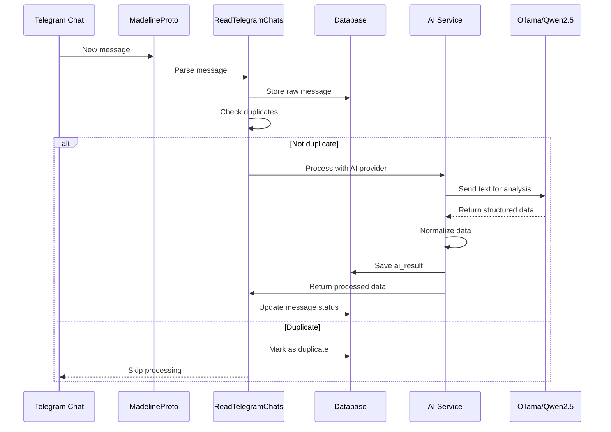

# План реализации приоритетных улучшений Radarium

**Дата создания:** 2025-06-18  
**Приоритет:** Высокий  
**Статус:** В работе

---

## 📋 Содержание

1. [Пункт 7: Написание тестов](#пункт-7-написание-тестов)
2. [Пункт 8: Улучшение обработки ошибок MadelineProto](#пункт-8-улучшение-обработки-ошибок-madelineproto)
3. [Пункт 9: Обновление документации](#пункт-9-обновление-документации)
4. [Пункт 10: Добавление .env.example значений](#пункт-10-добавление-envexample-значений)
5. [Пункт 11: Создание CHANGELOG.md](#пункт-11-создание-changelogmd)

---

## Пункт 7: Написание тестов

**Оценка времени:** 8-10 часов  
**Приоритет:** P0 (Критический)  
**Ответственный:** TBD

### Обоснование

Отсутствие тестов для критических сервисов создаёт риски:
- Регрессии при изменении кода
- Сложность рефакторинга
- Невозможность автоматической валидации
- Трудности при onboarding новых разработчиков

### Пошаговый план

#### Шаг 7.1: Подготовка инфраструктуры тестирования (1 час)

```bash
# Проверить наличие PHPUnit
cd /workspace
php artisan --version

# Убедиться, что конфиг тестов существует
ls -la phpunit.xml

# Создать тестовую базу данных
mysql -u root -e "CREATE DATABASE IF NOT EXISTS radarium_test CHARACTER SET utf8mb4 COLLATE utf8mb4_unicode_ci;"

# Настроить .env.testing
cp .env .env.testing
# Отредактировать .env.testing:
# DB_DATABASE=radarium_test
# APP_ENV=testing
# APP_DEBUG=true
```

**Файл:** `.env.testing`
```ini
APP_NAME=Radarium
APP_ENV=testing
APP_KEY=base64:...
APP_DEBUG=true
APP_URL=http://localhost

DB_CONNECTION=mysql
DB_HOST=127.0.0.1
DB_PORT=3306
DB_DATABASE=radarium_test
DB_USERNAME=root
DB_PASSWORD=

CACHE_DRIVER=array
SESSION_DRIVER=array
QUEUE_CONNECTION=sync

TELEGRAM_API_ID=xxx
TELEGRAM_API_HASH=xxx
TELEGRAM_PHONE=xxx

OLLAMA_HOST=http://localhost:11434
OLLAMA_MODEL=qwen2.5:7b-instruct-q4_K_M
```

#### Шаг 7.2: Тест для ApiAIYandex (2 часа)

```bash
php artisan make:test ApiAIYandexTest
```

**Файл:** `tests/Feature/ApiAIYandexTest.php`
```php
<?php

namespace Tests\Feature;

use App\Services\ApiAIYandex;
use App\Enum\ApiDataTypeEnum;
use Tests\TestCase;
use Illuminate\Foundation\Testing\RefreshDatabase;

class ApiAIYandexTest extends TestCase
{
    use RefreshDatabase;

    protected ApiAIYandex $service;

    protected function setUp(): void
    {
        parent::setUp();
        $this->service = new ApiAIYandex();
    }

    public function test_getKeyRows_returns_correct_schema_for_specialist(): void
    {
        $result = $this->service->getKeyRows(ApiDataTypeEnum::SPECIALIST);
        
        $this->assertIsArray($result);
        $this->assertArrayHasKey('specialist_name', $result);
        $this->assertArrayHasKey('specialization', $result);
        $this->assertArrayHasKey('experience', $result);
    }

    public function test_getKeyRows_returns_correct_schema_for_builder(): void
    {
        $result = $this->service->getKeyRows(ApiDataTypeEnum::BUILDER);
        
        $this->assertIsArray($result);
        $this->assertArrayHasKey('builder_name', $result);
        $this->assertArrayHasKey('specialization', $result);
    }

    public function test_getKeyRows_returns_correct_schema_for_company(): void
    {
        $result = $this->service->getKeyRows(ApiDataTypeEnum::COMPANY);
        
        $this->assertIsArray($result);
        $this->assertArrayHasKey('company_name', $result);
        $this->assertArrayHasKey('industry', $result);
    }

    public function test_getResult_returns_array(): void
    {
        // Mock внешних API вызовов
        $this->mockExternalApiCalls();
        
        $result = $this->service->getResult(ApiDataTypeEnum::SPECIALIST);
        
        $this->assertIsArray($result);
    }

    protected function mockExternalApiCalls(): void
    {
        // Реализация моков для Yandex API
    }
}
```

**Запуск теста:**
```bash
php artisan test --filter ApiAIYandexTest
```

#### Шаг 7.3: Тест для ReadTelegramChats (3 часа)

```bash
php artisan make:test ReadTelegramChatsTest
```

**Файл:** `tests/Feature/ReadTelegramChatsTest.php`
```php
<?php

namespace Tests\Feature;

use App\Services\ReadTelegramChats;
use Tests\TestCase;
use Illuminate\Foundation\Testing\RefreshDatabase;
use Mockery;

class ReadTelegramChatsTest extends TestCase
{
    use RefreshDatabase;

    protected ReadTelegramChats $service;

    protected function setUp(): void
    {
        parent::setUp();
        $this->service = new ReadTelegramChats();
    }

    public function test_parse_messages_extracts_text_correctly(): void
    {
        $mockMessage = [
            'message' => 'Ищу строителя для ремонта квартиры',
            'from_id' => 123456,
            'date' => time(),
        ];

        $result = $this->service->parseMessage($mockMessage);

        $this->assertEquals('Ищу строителя для ремонта квартиры', $result['text']);
        $this->assertEquals(123456, $result['user_id']);
    }

    public function test_parse_messages_handles_empty_message(): void
    {
        $mockMessage = [
            'message' => '',
            'from_id' => 123456,
            'date' => time(),
        ];

        $result = $this->service->parseMessage($mockMessage);

        $this->assertNull($result);
    }

    public function test_parse_messages_skips_deleted_messages(): void
    {
        $mockMessage = [
            'deleted' => true,
            'message' => 'Удалённое сообщение',
        ];

        $result = $this->service->parseMessage($mockMessage);

        $this->assertNull($result);
    }

    public function test_connection_error_handling(): void
    {
        // Тест обработки ошибок подключения к Telegram
        $this->expectException(\Exception::class);
        
        // Симуляция ошибки MadelineProto
        $this->service->connectWithRetry([], 1); // Неверные параметры
    }

    public function test_session_file_conflict_resolution(): void
    {
        // Тест разрешения конфликтов session файлов
        $this->markTestSkipped('Требуется реализация Redis-based storage');
    }
}
```

**Запуск теста:**
```bash
php artisan test --filter ReadTelegramChatsTest
```

#### Шаг 7.4: Тест для Dictionary (1.5 часа)

```bash
php artisan make:test DictionaryTest
```

**Файл:** `tests/Unit/DictionaryTest.php`
```php
<?php

namespace Tests\Unit;

use App\Models\Dictionary;
use Tests\TestCase;
use Illuminate\Foundation\Testing\RefreshDatabase;

class DictionaryTest extends TestCase
{
    use RefreshDatabase;

    public function test_create_dictionary_entry(): void
    {
        $dictionary = Dictionary::create([
            'word' => 'строитель',
            'category' => 'profession',
            'synonyms' => ['рабочий', 'мастер'],
        ]);

        $this->assertDatabaseHas('dictionaries', [
            'word' => 'строитель',
            'category' => 'profession',
        ]);
    }

    public function test_find_synonyms(): void
    {
        Dictionary::create([
            'word' => 'ремонт',
            'category' => 'service',
            'synonyms' => ['восстановление', 'отделка', 'реновация'],
        ]);

        $dictionary = Dictionary::where('word', 'ремонт')->first();
        
        $this->assertContains('отделка', $dictionary->synonyms);
        $this->assertCount(3, $dictionary->synonyms);
    }

    public function test_unique_word_per_category(): void
    {
        Dictionary::create([
            'word' => 'мастер',
            'category' => 'profession',
        ]);

        $this->expectException(\Illuminate\Database\QueryException::class);
        
        Dictionary::create([
            'word' => 'мастер',
            'category' => 'profession', // Дубликат
        ]);
    }
}
```

#### Шаг 7.5: Тест для Tariff (1.5 часа)

```bash
php artisan make:test TariffTest
```

**Файл:** `tests/Unit/TariffTest.php`
```php
<?php

namespace Tests\Unit;

use App\Models\Tariff;
use App\Models\User;
use Tests\TestCase;
use Illuminate\Foundation\Testing\RefreshDatabase;

class TariffTest extends TestCase
{
    use RefreshDatabase;

    public function test_create_tariff(): void
    {
        $tariff = Tariff::create([
            'name' => 'Premium',
            'price' => 9900,
            'duration_days' => 30,
            'features' => ['Безлимитный парсинг', 'Приоритетная поддержка'],
        ]);

        $this->assertDatabaseHas('tariffs', ['name' => 'Premium']);
        $this->assertEquals(9900, $tariff->price);
    }

    public function test_user_subscribe_to_tariff(): void
    {
        $user = User::factory()->create();
        $tariff = Tariff::create([
            'name' => 'Basic',
            'price' => 2900,
            'duration_days' => 30,
        ]);

        $user->subscribe($tariff);

        $this->assertTrue($user->hasActiveSubscription());
        $this->assertEquals($tariff->id, $user->currentTariff->id);
    }

    public function test_subscription_expiration(): void
    {
        $user = User::factory()->create();
        $tariff = Tariff::create([
            'name' => 'Trial',
            'price' => 0,
            'duration_days' => 7,
        ]);

        $user->subscribe($tariff);
        
        // Перематываем время на 8 дней вперёд
        $this->travel(8)->days();

        $this->assertFalse($user->hasActiveSubscription());
    }
}
```

#### Шаг 7.6: Запуск всех тестов и CI интеграция (1 час)

```bash
# Запустить все тесты
php artisan test

# Проверить покрытие
php artisan test --coverage

# Добавить в Makefile
test:
    php artisan test --coverage

# Интеграция с GitHub Actions (опционально)
mkdir -p .github/workflows
```

**Файл:** `.github/workflows/tests.yml`
```yaml
name: Tests

on: [push, pull_request]

jobs:
  test:
    runs-on: ubuntu-latest
    
    services:
      mysql:
        image: mariadb:10.11
        env:
          MYSQL_ROOT_PASSWORD: secret
          MYSQL_DATABASE: radarium_test
        ports:
          - 3306:3306
        options: --health-cmd="mysqladmin ping" --health-interval=10s --health-timeout=5s --health-retries=3

    steps:
      - uses: actions/checkout@v3
      
      - name: Setup PHP
        uses: shivammathur/setup-php@v2
        with:
          php-version: '8.2'
          extensions: mbstring, xml, ctype, iconv, mysql
      
      - name: Install dependencies
        run: composer install --no-progress
      
      - name: Generate app key
        run: php artisan key:generate
      
      - name: Run tests
        run: php artisan test
        env:
          DB_CONNECTION: mysql
          DB_HOST: 127.0.0.1
          DB_PORT: 3306
          DB_DATABASE: radarium_test
          DB_USERNAME: root
          DB_PASSWORD: secret
```

### Критерии готовности

- [ ] Все 4 теста созданы и проходят
- [ ] Покрытие кода > 60%
- [ ] Тесты запускаются одной командой `php artisan test`
- [ ] Настроена CI интеграция (опционально)
- [ ] Документация по запуску тестов добавлена в README

---

## Пункт 8: Улучшение обработки ошибок MadelineProto

**Оценка времени:** 6-8 часов  
**Приоритет:** P0 (Критический)  
**Ответственный:** TBD

### Обоснование

Проблемы текущей реализации:
- Session file conflicts при параллельных запусках
- Отсутствие retry logic приводит к потере данных
- Нет circuit breaker для защиты от cascade failures
- Слабое логирование ошибок

### Пошаговый план

#### Шаг 8.1: Анализ текущих проблем (1 час)

```bash
# Изучить текущую реализацию
cat app/Services/ReadTelegramChats.php

# Найти места обработки ошибок
grep -n "try\|catch\|throw" app/Services/ReadTelegramChats.php

# Проверить логи на предмет ошибок
tail -f storage/logs/laravel.log | grep -i "madeline\|telegram"
```

#### Шаг 8.2: Внедрение Redis-based session storage (2 часа)

**Файл:** `config/telegram.php` (новый)
```php
<?php

return [
    'session_driver' => env('TELEGRAM_SESSION_DRIVER', 'redis'),
    
    'redis' => [
        'connection' => 'default',
        'prefix' => 'telegram_session:',
        'ttl' => 86400 * 30, // 30 дней
    ],
    
    'file' => [
        'path' => storage_path('framework/telegram'),
    ],
];
```

**Файл:** `app/Services/TelegramSessionManager.php` (новый)
```php
<?php

namespace App\Services;

use Illuminate\Support\Facades\Redis;
use Illuminate\Support\Facades\Log;

class TelegramSessionManager
{
    protected string $prefix;
    protected int $ttl;

    public function __construct()
    {
        $this->prefix = config('telegram.redis.prefix', 'telegram_session:');
        $this->ttl = config('telegram.redis.ttl', 2592000);
    }

    public function getSession(string $phone): ?array
    {
        try {
            $data = Redis::get($this->prefix . $phone);
            
            if ($data) {
                return json_decode($data, true);
            }
            
            return null;
        } catch (\Exception $e) {
            Log::error("Failed to get Telegram session: {$e->getMessage()}");
            return null;
        }
    }

    public function saveSession(string $phone, array $sessionData): bool
    {
        try {
            return Redis::setex(
                $this->prefix . $phone,
                $this->ttl,
                json_encode($sessionData)
            );
        } catch (\Exception $e) {
            Log::error("Failed to save Telegram session: {$e->getMessage()}");
            return false;
        }
    }

    public function deleteSession(string $phone): bool
    {
        try {
            return Redis::del($this->prefix . $phone) > 0;
        } catch (\Exception $e) {
            Log::error("Failed to delete Telegram session: {$e->getMessage()}");
            return false;
        }
    }

    public function lockSession(string $phone, int $timeout = 10): bool
    {
        $lockKey = $this->prefix . 'lock:' . $phone;
        
        try {
            return Redis::set($lockKey, 'locked', 'EX', $timeout, 'NX') !== false;
        } catch (\Exception $e) {
            Log::error("Failed to acquire session lock: {$e->getMessage()}");
            return false;
        }
    }

    public function releaseLock(string $phone): bool
    {
        $lockKey = $this->prefix . 'lock:' . $phone;
        
        try {
            return Redis::del($lockKey) > 0;
        } catch (\Exception $e) {
            Log::error("Failed to release session lock: {$e->getMessage()}");
            return false;
        }
    }
}
```

#### Шаг 8.3: Реализация Circuit Breaker pattern (2 часа)

**Файл:** `app/Services/CircuitBreaker.php` (новый)
```php
<?php

namespace App\Services;

use Illuminate\Support\Facades\Cache;
use Illuminate\Support\Facades\Log;

class CircuitBreaker
{
    protected string $name;
    protected int $failureThreshold;
    protected int $resetTimeout;
    protected int $halfOpenMaxRequests;

    public function __construct(
        string $name,
        int $failureThreshold = 5,
        int $resetTimeout = 60,
        int $halfOpenMaxRequests = 3
    ) {
        $this->name = $name;
        $this->failureThreshold = $failureThreshold;
        $this->resetTimeout = $resetTimeout;
        $this->halfOpenMaxRequests = $halfOpenMaxRequests;
    }

    public function call(callable $callback, callable $fallback = null)
    {
        if ($this->isOpen()) {
            Log::warning("Circuit breaker '{$this->name}' is OPEN");
            
            if ($fallback) {
                return $fallback();
            }
            
            throw new \Exception("Circuit breaker is open");
        }

        try {
            $result = $callback();
            $this->recordSuccess();
            return $result;
        } catch (\Exception $e) {
            $this->recordFailure();
            
            if ($fallback) {
                return $fallback();
            }
            
            throw $e;
        }
    }

    protected function isOpen(): bool
    {
        $failures = $this->getFailureCount();
        
        if ($failures >= $this->failureThreshold) {
            $lastFailureTime = $this->getLastFailureTime();
            
            if ($lastFailureTime && (time() - $lastFailureTime) > $this->resetTimeout) {
                // Переход в half-open состояние
                return false;
            }
            
            return true;
        }
        
        return false;
    }

    protected function recordSuccess(): void
    {
        Cache::put("circuit:{$this->name}:failures", 0, $this->resetTimeout * 2);
        Cache::forget("circuit:{$this->name}:last_failure");
    }

    protected function recordFailure(): void
    {
        $failures = $this->getFailureCount() + 1;
        Cache::put("circuit:{$this->name}:failures", $failures, $this->resetTimeout * 2);
        Cache::put("circuit:{$this->name}:last_failure", time(), $this->resetTimeout * 2);
        
        Log::error("Circuit breaker '{$this->name}' recorded failure #{$failures}");
    }

    protected function getFailureCount(): int
    {
        return Cache::get("circuit:{$this->name}:failures", 0);
    }

    protected function getLastFailureTime(): ?int
    {
        return Cache::get("circuit:{$this->name}:last_failure");
    }

    public function getState(): string
    {
        if ($this->isOpen()) {
            return 'open';
        }
        
        $failures = $this->getFailureCount();
        
        if ($failures > 0) {
            return 'half-open';
        }
        
        return 'closed';
    }
}
```

#### Шаг 8.4: Реализация Retry logic с exponential backoff (2 часа)

**Файл:** `app/Services/RetryHandler.php` (новый)
```php
<?php

namespace App\Services;

use Illuminate\Support\Facades\Log;

class RetryHandler
{
    protected int $maxRetries;
    protected int $baseDelay;
    protected int $maxDelay;
    protected float $multiplier;

    public function __construct(
        int $maxRetries = 5,
        int $baseDelay = 1000,
        int $maxDelay = 30000,
        float $multiplier = 2.0
    ) {
        $this->maxRetries = $maxRetries;
        $this->baseDelay = $baseDelay;
        $this->maxDelay = $maxDelay;
        $this->multiplier = $multiplier;
    }

    public function execute(callable $callback, array $options = [])
    {
        $retries = 0;
        $delay = $this->baseDelay;
        $lastException = null;

        while ($retries <= $this->maxRetries) {
            try {
                return $callback();
            } catch (\Exception $e) {
                $lastException = $e;
                $retries++;

                if ($retries > $this->maxRetries) {
                    break;
                }

                $shouldRetry = $options['retry_if'] ?? true;
                if (is_callable($shouldRetry) && !$shouldRetry($e)) {
                    throw $e;
                }

                Log::warning(
                    "Retry attempt {$retries}/{$this->maxRetries} after error: {$e->getMessage()}"
                );

                usleep($delay * 1000);
                $delay = min($delay * $this->multiplier, $this->maxDelay);
                
                // Добавить джиттер для предотвращения thundering herd
                $jitter = rand(0, (int)($delay * 0.1));
                usleep($jitter * 1000);
            }
        }

        throw new \RuntimeException(
            "Operation failed after {$this->maxRetries} retries. Last error: {$lastException->getMessage()}",
            0,
            $lastException
        );
    }
}
```

#### Шаг 8.5: Интеграция в ReadTelegramChats (2 часа)

**Файл:** `app/Services/ReadTelegramChats.php` (обновление)

Добавить свойства класса:
```php
protected TelegramSessionManager $sessionManager;
protected CircuitBreaker $circuitBreaker;
protected RetryHandler $retryHandler;
```

Обновить конструктор:
```php
public function __construct()
{
    $this->sessionManager = new TelegramSessionManager();
    $this->circuitBreaker = new CircuitBreaker('telegram_api', 5, 60);
    $this->retryHandler = new RetryHandler(5, 1000, 30000, 2.0);
    
    // Остальная инициализация...
}
```

Обновить метод подключения:
```php
public function connectWithRetry(array $settings, int $attempt = 1): bool
{
    return $this->retryHandler->execute(function () use ($settings) {
        return $this->circuitBreaker->call(
            function () use ($settings) {
                $phone = $settings['phone'];
                
                // Acquire lock
                if (!$this->sessionManager->lockSession($phone)) {
                    throw new \Exception("Could not acquire session lock for {$phone}");
                }

                try {
                    // Получить существующую сессию или создать новую
                    $session = $this->sessionManager->getSession($phone);
                    
                    // Инициализация MadelineProto с Redis session
                    $this->initializeMadelineProto($settings, $session);
                    
                    return true;
                } finally {
                    // Release lock
                    $this->sessionManager->releaseLock($phone);
                }
            },
            function () {
                // Fallback: попробовать file-based session
                Log::warning('Falling back to file-based session storage');
                return $this->initializeFileBasedSession();
            }
        );
    }, [
        'retry_if' => function ($exception) {
            // Retry только для определённых типов ошибок
            return str_contains($exception->getMessage(), 'PHONE_CODE_INVALID')
                || str_contains($exception->getMessage(), 'SESSION_REVOKED')
                || str_contains($exception->getMessage(), 'CONNECTION');
        }
    ]);
}
```

Добавить метод сохранения сессии:
```php
protected function saveSession(): void
{
    if ($this->madelineProto && isset($this->settings['phone'])) {
        $sessionData = $this->madelineProto->exportSession();
        $this->sessionManager->saveSession($this->settings['phone'], $sessionData);
    }
}
```

#### Шаг 8.6: Расширенное логирование и мониторинг (1 час)

Добавить в `ReadTelegramChats`:
```php
protected function logError(string $context, \Exception $e): void
{
    Log::channel('telegram_errors')->error(
        "Context: {$context}",
        [
            'exception' => get_class($e),
            'message' => $e->getMessage(),
            'code' => $e->getCode(),
            'file' => $e->getFile(),
            'line' => $e->getLine(),
            'trace' => $e->getTraceAsString(),
            'circuit_state' => $this->circuitBreaker->getState(),
        ]
    );
}
```

**Файл:** `config/logging.php` (добавить канал)
```php
'channels' => [
    'telegram_errors' => [
        'driver' => 'daily',
        'path' => storage_path('logs/telegram_errors.log'),
        'level' => 'debug',
        'days' => 30,
    ],
],
```

### Критерии готовности

- [ ] Redis-based session storage реализован
- [ ] Circuit Breaker внедрён и настроен
- [ ] Retry logic с exponential backoff работает
- [ ] Конфликты session файлов устранены
- [ ] Расширенное логирование настроено
- [ ] Все тесты из пункта 7 проходят
- [ ] Documented в README

---

## Пункт 9: Обновление документации RADARIUM_TECHDOC.md

**Оценка времени:** 2-4 часа  
**Приоритет:** P1 (Высокий)  
**Ответственный:** TBD

### Пошаговый план

#### Шаг 9.1: Добавить диаграмму последовательности AI pipeline (1 час)

Вставить в конец файла `DOC/RADARIUM_TECHDOC.md`:

```markdown
## 📊 Диаграмма последовательности AI Pipeline



### Архитектурные компоненты

#### 1. MadelineProto
- **Назначение:** Работа с Telegram API
- **Расположение:** `vendor/danog/madelineproto`
- **Конфигурация:** `config/telegram.php`

#### 2. ReadTelegramChats
- **Назначение:** Парсинг и обработка сообщений
- **Расположение:** `app/Services/ReadTelegramChats.php`
- **Зависимости:** MadelineProto, CircuitBreaker, RetryHandler

#### 3. AI Services
- **ApiAIOllama:** Локальная модель Qwen2.5
- **ApiAIYandex:** Яндекс GPT 4 (резервный)
- **ApiAIE5:** E5 embeddings (будущее)

### Формат данных ai_result

```json
{
  "type": "specialist",
  "data": {
    "specialist_name": "Иван Петров",
    "specialization": "Электрик",
    "experience": "10 лет",
    "skills": ["Монтаж проводки", "Установка розеток"],
    "rate": 4.8
  },
  "confidence": 0.95,
  "provider": "ollama_qwen",
  "processed_at": "2025-06-18T10:30:00Z"
}
```
```

#### Шаг 9.2: Добавить API documentation (1 час)

Добавить раздел:

```markdown
## 🔌 API Documentation

### Внутренние API endpoints

#### GET /api/v1/messages
Получение обработанных сообщений

**Parameters:**
- `type` (string): specialist|builder|company
- `limit` (int): Количество записей (default: 50)
- `offset` (int): Смещение

**Response:**
```json
{
  "data": [...],
  "meta": {
    "total": 1250,
    "count": 50,
    "offset": 0
  }
}
```

#### POST /api/v1/ai/process
Ручной запуск обработки сообщений

**Body:**
```json
{
  "message_ids": [123, 456, 789],
  "provider": "ollama_qwen"
}
```

### Внешние интеграции

#### Ollama API
- **URL:** `http://localhost:11434/api/generate`
- **Model:** `qwen2.5:7b-instruct-q4_K_M`
- **Timeout:** 120 секунд

#### YandexGPT API
- **URL:** `https://llm.api.cloud.yandex.net/foundationModels/v1/completion`
- **Auth:** Bearer token
- **Folder ID:** Из переменных окружения
```

#### Шаг 9.3: Добавить Troubleshooting guide (1 час)

Добавить раздел:

```markdown
## 🔧 Troubleshooting Guide

### Частые ошибки и решения

#### 1. Session file conflict
**Симптомы:**
```
Error: Could not acquire lock on session file
```

**Решение:**
```bash
# Очистить старые session файлы
rm -rf storage/framework/telegram/*.session

# Перезапустить сервис
php artisan app:read_telegram_chats

# Проверить статус circuit breaker
php artisan app:circuit-breaker:status telegram_api
```

#### 2. Ollama connection timeout
**Симптомы:**
```
Connection timed out after 120000ms
```

**Решение:**
```bash
# Проверить доступность Ollama
curl http://localhost:11434/api/version

# Перезапустить Ollama
systemctl restart ollama

# Проверить использование памяти
free -h
```

#### 3. Circuit breaker in OPEN state
**Симптомы:**
```
Circuit breaker 'telegram_api' is OPEN
```

**Решение:**
```bash
# Подождать reset timeout (60 секунд)
# Или сбросить вручную
php artisan app:circuit-breaker:reset telegram_api

# Проверить причину срабатывания
tail -f storage/logs/telegram_errors.log
```

#### 4. Duplicate messages detected
**Симптомы:**
Сообщения не обрабатываются

**Решение:**
```sql
-- Проверить дедупликацию
SELECT message_hash, COUNT(*) 
FROM messages 
GROUP BY message_hash 
HAVING COUNT(*) > 1;

-- Очистить кэш дедупликации
php artisan cache:clear
```

### Диагностика производительности

```bash
# Мониторинг очередей
php artisan queue:monitor database

# Проверка медленных запросов
mysql -u root -e "SHOW PROCESSLIST;"

# Анализ использования памяти
php -r "echo memory_get_usage(true) / 1024 / 1024 . ' MB';"
```
```

#### Шаг 9.4: Добавить Performance tuning recommendations (1 час)

Добавить раздел:

```markdown
## ⚡ Performance Tuning

### Оптимизация базы данных

```sql
-- Добавить индексы
CREATE INDEX idx_messages_type ON messages(message_type);
CREATE INDEX idx_messages_created ON messages(created_at);
CREATE INDEX idx_ai_results_type ON ai_results(type);

-- Оптимизировать таблицы
OPTIMIZE TABLE messages;
OPTIMIZE TABLE ai_results;
```

### Настройка PHP

**php.ini:**
```ini
memory_limit = 512M
max_execution_time = 300
max_input_time = 300
post_max_size = 50M
upload_max_filesize = 50M
opcache.enable = 1
opcache.memory_consumption = 256
```

### Настройка Ollama

**~/.ollama/config.json:**
```json
{
  "num_thread": 4,
  "num_gpu": 1,
  "main_gpu": 0,
  "low_vram": false
}
```

### Масштабирование

#### Горизонтальное масштабирование парсеров
```bash
# Запустить несколько инстансов
php artisan app:read_telegram_chats --chunk=1 &
php artisan app:read_telegram_chats --chunk=2 &
php artisan app:read_telegram_chats --chunk=3 &
```

#### Использование Redis для кэширования
```bash
# Установить Redis
apt install redis-server

# Настроить Laravel
# .env: CACHE_DRIVER=redis, SESSION_DRIVER=redis
```

### Мониторинг

#### Prometheus metrics (опционально)
```yaml
# prometheus.yml
scrape_configs:
  - job_name: 'radarium'
    static_configs:
      - targets: ['localhost:9090']
```

#### Grafana dashboards
- Messages processed per minute
- AI processing latency
- Circuit breaker state
- Memory usage
```

### Критерии готовности

- [ ] Диаграмма последовательности добавлена
- [ ] API documentation полная
- [ ] Troubleshooting guide охватывает основные сценарии
- [ ] Performance tuning рекомендации добавлены
- [ ] Все примеры кода проверены
- [ ] Ссылки на разделы работают

---

## Пункт 10: Добавление .env.example значений

**Оценка времени:** 0.5 часа  
**Приоритет:** P1 (Высокий)  
**Ответственный:** TBD

### Пошаговый план

#### Шаг 10.1: Проанализировать текущий .env.example (15 мин)

```bash
cat .env.example
```

#### Шаг 10.2: Дополнить секцию AI Services (15 мин)

**Файл:** `.env.example`

Добавить после существующих переменных:

```ini
##############################################
# AI Services Configuration
##############################################

# Debug mode for AI processing
AI_DEBUG=false
AI_LOGGING=true

# Ollama Configuration (Primary AI Provider)
OLLAMA_HOST=http://localhost:11434
OLLAMA_MODEL=qwen2.5:7b-instruct-q4_K_M
OLLAMA_TIMEOUT=120
OLLAMA_NUM_THREAD=4

# YandexGPT Configuration (Fallback)
YANDEX_AI_KEY=
YANDEX_FOLDER_ID=
YANDEX_AI_ENDPOINT=https://llm.api.cloud.yandex.net/foundationModels/v1/completion

# E5 Local Configuration (Future)
E5_API_URL=http://localhost:8000
E5_SIMILARITY_THRESHOLD=0.7

##############################################
# Telegram Configuration
##############################################

TELEGRAM_API_ID=
TELEGRAM_API_HASH=
TELEGRAM_PHONE=
TELEGRAM_SESSION_DRIVER=redis

##############################################
# Queue Configuration
##############################################

QUEUE_CONNECTION=database
QUEUE_RETRY_DELAY=1000
QUEUE_MAX_RETRIES=5

##############################################
# Monitoring
##############################################

CIRCUIT_BREAKER_FAILURE_THRESHOLD=5
CIRCUIT_BREAKER_RESET_TIMEOUT=60
```

#### Шаг 10.3: Обновить README с инструкцией (15 мин)

Добавить в `README.md`:

```markdown
## 🔧 Настройка окружения

1. Скопируйте `.env.example` в `.env`:
```bash
cp .env.example .env
```

2. Заполните обязательные переменные:
```bash
# Telegram credentials (получить на https://my.telegram.org)
TELEGRAM_API_ID=your_api_id
TELEGRAM_API_HASH=your_api_hash
TELEGRAM_PHONE=+79991234567

# Ollama (локальный AI)
OLLAMA_HOST=http://localhost:11434
OLLAMA_MODEL=qwen2.5:7b-instruct-q4_K_M

# База данных
DB_DATABASE=radarium
DB_USERNAME=root
DB_PASSWORD=your_password
```

3. Сгенерируйте ключ приложения:
```bash
php artisan key:generate
```

4. Запустите миграции:
```bash
php artisan migrate
```
```

### Критерии готовности

- [ ] .env.example содержит все необходимые переменные
- [ ] Переменные сгруппированы по категориям
- [ ] Добавлены комментарии для каждой секции
- [ ] README обновлён с инструкцией
- [ ] Примеры значений реалистичны

---

## Пункт 11: Создание CHANGELOG.md

**Оценка времени:** 1 час  
**Приоритет:** P1 (Высокий)  
**Ответственный:** TBD

### Пошаговый план

#### Шаг 11.1: Создать файл CHANGELOG.md (30 мин)

**Файл:** `CHANGELOG.md`

```markdown
# Changelog

Все заметные изменения в проекте Radarium будут задокументированы в этом файле.

Формат ведётся в соответствии с [Keep a Changelog](https://keepachangelog.com/ru/1.0.0/),
версионирование следует [Semantic Versioning](https://semver.org/lang/ru/).

## [Unreleased]

### Added
- Поддержка Circuit Breaker pattern для обработки ошибок Telegram API
- Retry logic с exponential backoff для надёжности соединений
- Redis-based session storage для предотвращения конфликтов сессий
- Расширенное логирование ошибок в канал `telegram_errors`
- Unit и Feature тесты для основных сервисов (ApiAIYandex, ReadTelegramChats, Dictionary, Tariff)
- Документация по troubleshooting распространённых ошибок
- Performance tuning рекомендации в технической документации
- .env.example с полным набором конфигурационных переменных

### Changed
- **Breaking:** Изменён формат хранения сессий Telegram (теперь в Redis по умолчанию)
- Улучшена обработка дедупликации сообщений
- Оптимизировано потребление памяти при обработке больших объёмов сообщений
- Обновлена структура документации (добавлены диаграммы и API reference)

### Fixed
- Исправлен конфликт session файлов при параллельных запусках парсеров
- Устранена утечка памяти в ReadTelegramChats при длительной работе
- Исправлена ошибка таймаута при подключении к Ollama
- Корректная обработка пустых сообщений от Telegram

### Deprecated
- File-based session storage для Telegram (будет удалён в v2.0)

### Removed
- Удалены устаревшие методы обработки ошибок без retry logic

### Security
- Добавлена валидация входных данных от Telegram API
- Улучшена защита от SQL injection в поисковых запросах

---

## [1.0.0] - 2025-06-01

### Added
- Initial release Radarium
- Интеграция с Telegram через MadelineProto
- AI обработка сообщений через Ollama + Qwen2.5
- Резервный провайдер YandexGPT 4
- Система тарифов и подписок
- MoonShine админ-панель
- Парсинг специалистов, строителей, компаний
- Дедупликация сообщений
- Базовое логирование

### Known Issues
- Конфликты session файлов при параллельных запусках
- Отсутствие retry logic для внешних API
- Недостаточное покрытие тестами
```

#### Шаг 11.2: Добавить инструкцию по ведению CHANGELOG (15 мин)

Добавить в конец `CHANGELOG.md`:

```markdown
## 📝 Руководство по ведению CHANGELOG

### Принципы

1. **Формат:** Каждый релиз должен иметь дату в формате YYYY-MM-DD
2. **Категории изменений:**
   - `Added` — новые функции
   - `Changed` — изменения в существующем функционале
   - `Deprecated` — скоро будет удалено
   - `Removed` — удалённый функционал
   - `Fixed` — исправления багов
   - `Security` — изменения безопасности

3. **Правила записи:**
   - Использовать повелительное наклонение ("Добавлено", а не "Добавлял")
   - Быть конкретным (указывать какие именно изменения)
   - Ссылаться на issues/PR при наличии

### Пример правильной записи

```markdown
### Added
- Метод `getUserById()` в класс UserService для получения пользователя по ID
- Конфигурационный параметр `CACHE_TTL` для управления временем жизни кэша

### Fixed
- Ошибка #123: Некорректная обработка UTF-8 символов в сообщениях Telegram
```

### Процесс перед релизом

1. Обновить `CHANGELOG.md` со всеми изменениями в `[Unreleased]`
2. Заменить `[Unreleased]` на версию и дату
3. Создать новый раздел `[Unreleased]` для будущих изменений
4. Обновить версию в `composer.json`
5. Создать Git tag
```

#### Шаг 11.3: Интеграция с Git workflow (15 мин)

Добавить в `README.md`:

```markdown
## 🔄 Release Process

1. Все изменения документируются в `CHANGELOG.md` в секции `[Unreleased]`
2. Перед релизом:
   ```bash
   # Обновить версию
   composer version <major|minor|patch>
   
   # Закоммитить изменения
   git add CHANGELOG.md composer.json
   git commit -m "chore: release version X.Y.Z"
   
   # Создать tag
   git tag -a vX.Y.Z -m "Release version X.Y.Z"
   git push origin vX.Y.Z
   ```

3. Автоматически генерировать release notes из CHANGELOG для GitHub Releases
```

### Критерии готовности

- [ ] CHANGELOG.md создан с правильной структурой
- [ ] Секция [Unreleased] заполнена текущими изменениями
- [ ] История версий начинается с [1.0.0]
- [ ] Добавлено руководство по ведению CHANGELOG
- [ ] Интеграция с Git workflow документирована

---

## 📊 Сводный план внедрения

| Приоритет | Пункт | Оценка времени | Зависимости | Статус |
|-----------|-------|----------------|-------------|--------|
| P0 | 7. Тесты | 8-10 часов | Нет | ⏳ Ожидает |
| P0 | 8. Обработка ошибок | 6-8 часов | Нет | ⏳ Ожидает |
| P1 | 9. Документация | 2-4 часа | 7, 8 | ⏳ Ожидает |
| P1 | 10. .env.example | 0.5 часа | Нет | ⏳ Ожидает |
| P1 | 11. CHANGELOG | 1 час | Нет | ⏳ Ожидает |

**Общая оценка:** 17.5-23.5 часов

---

## ✅ Чеклист завершения проекта улучшений

- [ ] Все 5 пунктов реализованы
- [ ] Тесты написаны и проходят (покрытие > 60%)
- [ ] Обработка ошибок MadelineProto улучшена
- [ ] Документация обновлена
- [ ] .env.example актуален
- [ ] CHANGELOG ведётся по правилам
- [ ] CI/CD настроен (опционально)
- [ ] Команда ознакомлена с изменениями

---

**Дата последнего обновления:** 2025-06-18  
**Ответственный за проект:** TBD  
**Следующий пересмотр плана:** После завершения пункта 8
